# Week 05 Lab: Terraform IVPAD on Google Cloud Platform

## General Description

This repository contains a Terraform-based Google Cloud Platform (GCP) lab that demonstrates provider authentication, remote state backend configuration, persistent disk creation, API enablement, and custom VPC network provisioning.

The lab follows the Terraform IVPAD workflow:

1. **Init** — initialize Terraform and configure the remote backend.
2. **Validate** — validate Terraform syntax and configuration structure.
3. **Plan** — generate and inspect the execution plan.
4. **Apply** — provision the defined GCP resources.
5. **Destroy** — tear down the provisioned infrastructure.

The repository also includes screenshot-based execution evidence under the `deliverables/` directory.

---

## Purpose of the Repo

The purpose of this repository is to document and demonstrate a controlled Terraform deployment workflow against GCP. It is intended for technical reviewers, developers, DevOps engineers, DevSecOps engineers, cloud engineers, SREs, and platform engineers who need to verify that infrastructure was deployed and destroyed using a repeatable infrastructure-as-code process.

This repo shows:

- How Terraform authenticates to GCP using the Google provider.
- How a GCS bucket can be used as a Terraform remote backend.
- How to define a persistent disk resource in GCP.
- How to enable required GCP APIs using Terraform.
- How to create custom VPC networks with automatic subnet creation disabled.
- How to capture terminal evidence for each stage of the Terraform IVPAD lifecycle.
- How to confirm local execution context after infrastructure teardown using `date && hostname && whoami`.

---

## Overview of the Lab Done on this Repo

This lab provisions foundational GCP infrastructure using three Terraform files:

| File | Role |
| --- | --- |
| `0-authentication.tf` | Configures the Terraform Google provider and target GCP project/region. |
| `1-backend.tf` | Configures the GCS remote backend and defines a persistent disk resource. |
| `2-vpc.tf` | Enables required GCP services and creates custom VPC networks. |

The Terraform workflow was executed locally from the parent repository directory, `05-week-05`, and screenshots were captured under the `deliverables/` folder.

The lab creates or manages the following GCP-side resources:

- Google provider configuration targeting project `class75-michaelanunda`.
- GCS backend bucket reference: `falcontf75`.
- Terraform state prefix: `terraform/state`.
- Compute disk: `grafana-disk`.
- Enabled APIs:
  - `compute.googleapis.com`
  - `container.googleapis.com`
- Custom VPC networks:
  - `main`
  - `warrior-king`

> Engineering note: in production Terraform code, avoid managing the same `google_project_service` more than once in the same state. This lab includes duplicate service declarations for `compute.googleapis.com` and `container.googleapis.com` under separate Terraform resource names. For production hardening, consolidate each API into a single `google_project_service` resource.

---

## Necessary Prerequisites Before Doing this Lab

Before running this lab, confirm the following prerequisites are satisfied.

### Local Workstation Requirements

- Terraform installed and available in the shell path.
- Google Cloud CLI installed and configured.
- Git installed.
- Bash-compatible shell:
  - Git Bash for Windows, or
  - Terminal for macOS/Linux.
- Screenshot tool available for capturing terminal output.

### GCP Requirements

- Active GCP project: `class75-michaelanunda`.
- IAM permissions sufficient to:
  - enable project services/APIs,
  - create Compute Engine disks,
  - create VPC networks,
  - read/write Terraform state to a GCS bucket.
- Existing GCS bucket for Terraform backend state:
  - Bucket name: `falcontf75`
  - Backend prefix: `terraform/state`

The backend bucket must exist before running `terraform init`. Terraform cannot initialize a remote backend against a bucket that has not already been created.

### Authentication Requirements

Authenticate to GCP before executing Terraform:

```bash
gcloud auth login
gcloud auth application-default login
gcloud config set project class75-michaelanunda
```

Confirm the active project:

```bash
gcloud config get-value project
```

Expected project:

```text
class75-michaelanunda
```

---

## Deployment Instructions for `0-authentication.tf`

The `0-authentication.tf` file defines the Terraform Google provider and targets the intended GCP project and region.

```hcl
terraform {
  required_providers {
    google = {
      source  = "hashicorp/google"
      version = "~> 5.0"
    }
  }
}

provider "google" {
  project = "class75-michaelanunda"
  region  = "us-central1"
}
```

This file establishes the provider dependency and tells Terraform which GCP project and region to use.

Validate the provider target before deployment:

```bash
gcloud config get-value project
```

Then confirm Terraform can load the file during initialization and validation:

```bash
terraform init
terraform validate
```

---

## Deployment Instructions for `1-backend.tf`

The `1-backend.tf` file configures the remote backend and defines a Compute Engine persistent disk.

```hcl
terraform {
  backend "gcs" {
    bucket = "falcontf75"
    prefix = "terraform/state"
  }
}

resource "google_compute_disk" "grafana_disk" {
  name = "grafana-disk"
  type = "pd-standard"
  zone = "us-central1-a"
  size = 10
}
```

The backend block stores Terraform state remotely in GCS instead of only on the local machine.

Before running Terraform initialization, confirm the backend bucket exists:

```bash
gcloud storage buckets list | grep falcontf75
```

If the bucket does not already exist, create it before running `terraform init`:

```bash
gcloud storage buckets create gs://falcontf75 \
  --project=class75-michaelanunda \
  --location=US
```

Recommended backend hardening:

```bash
gcloud storage buckets update gs://falcontf75 --versioning
```

After the backend exists, initialize Terraform:

```bash
terraform init
```

---

## Deployment Instructions for `2-vpc.tf`

The `2-vpc.tf` file enables required GCP APIs and creates custom VPC networks.

The file manages the following APIs:

```hcl
resource "google_project_service" "compute" {
  service            = "compute.googleapis.com"
  disable_on_destroy = false
}

resource "google_project_service" "container" {
  service            = "container.googleapis.com"
  disable_on_destroy = false
}
```

It also creates a custom VPC named `main`:

```hcl
resource "google_compute_network" "main" {
  name                            = "main"
  routing_mode                    = "REGIONAL"
  auto_create_subnetworks         = false
  mtu                             = 1460
  delete_default_routes_on_create = false

  depends_on = [
    google_project_service.compute,
    google_project_service.container
  ]
}
```

The lab file also includes a second custom VPC named `warrior-king`:

```hcl
resource "google_compute_network" "warrior-king" {
  name                            = "warrior-king"
  routing_mode                    = "REGIONAL"
  auto_create_subnetworks         = false
  mtu                             = 1460
  delete_default_routes_on_create = false

  depends_on = [
    google_project_service.compute,
    google_project_service.container
  ]
}
```

After apply, verify the VPC networks from the CLI:

```bash
gcloud compute networks list --project=class75-michaelanunda
```

Expected VPC names include:

```text
main
warrior-king
```

You can also verify API enablement:

```bash
gcloud services list --enabled \
  --project=class75-michaelanunda \
  --filter="config.name:(compute.googleapis.com OR container.googleapis.com)"
```

---

## Deployment Instructions for Terraform Init

Run Terraform initialization from the parent repository folder:

```bash
cd 05-week-05
terraform init
```

Terraform init performs the following actions:

- Downloads required provider plugins.
- Initializes the GCS backend.
- Prepares the working directory for validation, planning, and deployment.

Execution evidence:

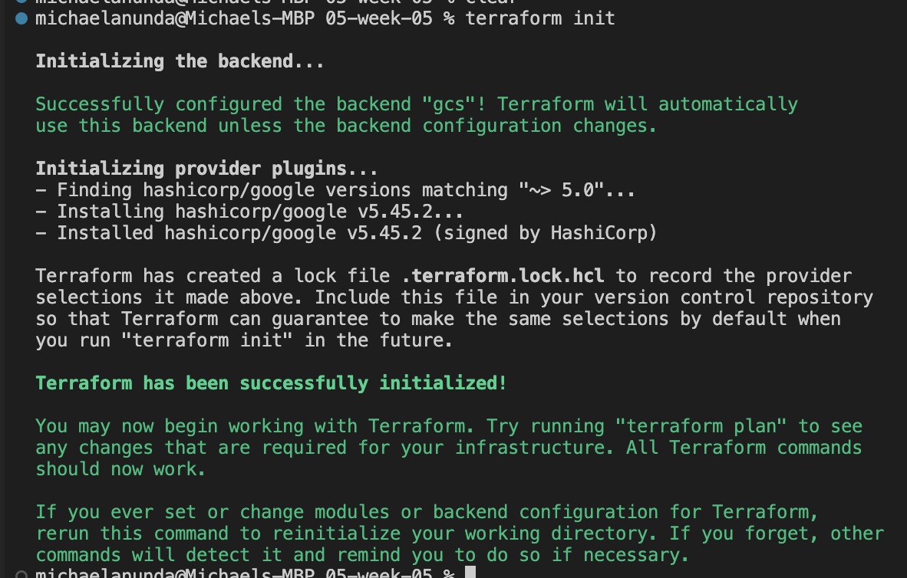

---

## Deployment Instructions for Terraform Validate

Run Terraform validation:

```bash
terraform validate
```

Terraform validate checks whether the configuration is syntactically valid and internally consistent.

Execution evidence:

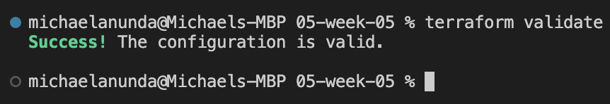

Expected successful output:

```text
Success! The configuration is valid.
```

---

## Deployment Instructions for Terraform Plan

Run Terraform plan:

```bash
terraform plan
```

Alternatively, save the plan to an execution file:

```bash
terraform plan -out=tfplan
```

Terraform plan previews the changes Terraform intends to make before modifying infrastructure.

Execution evidence:

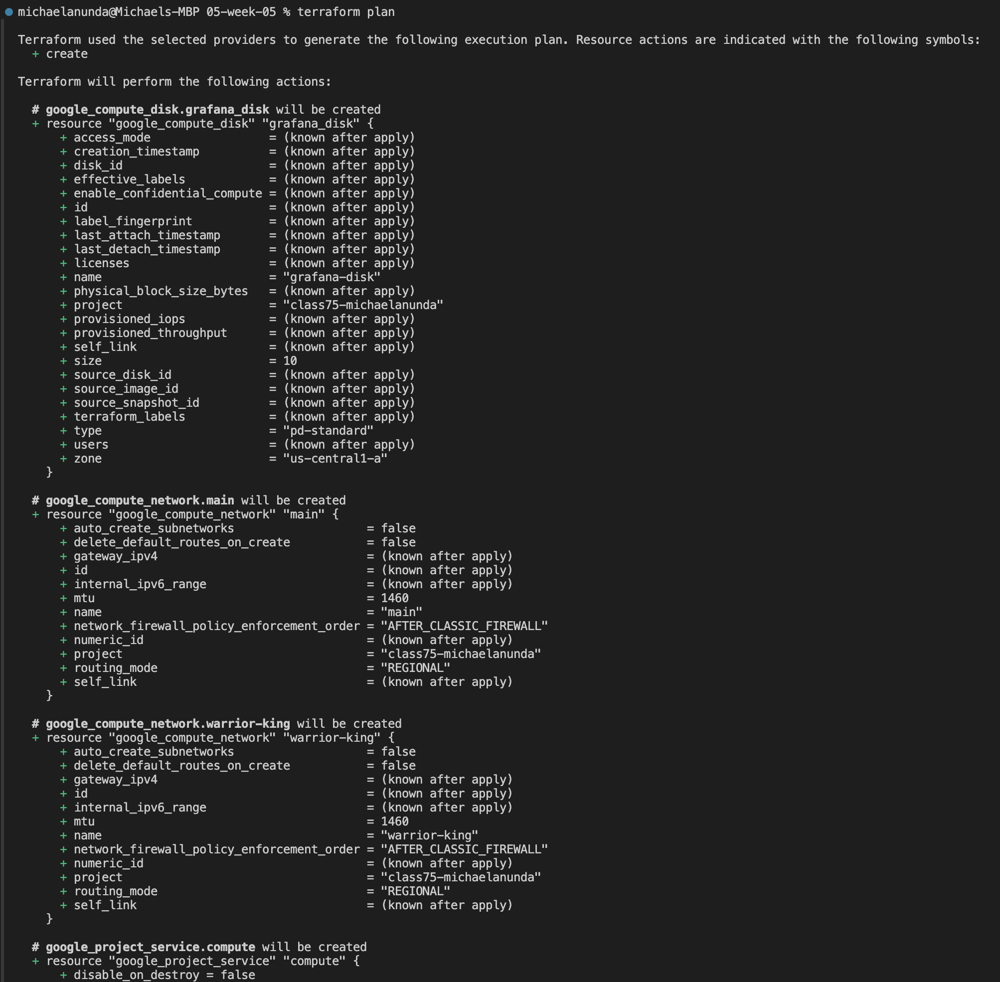

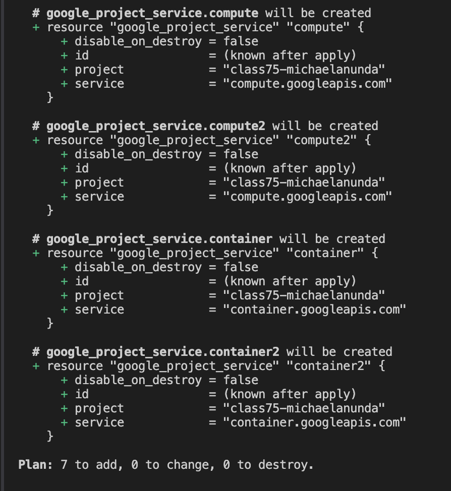

Review the plan carefully before applying. Confirm that the proposed resources match the intended lab scope.

---

## Deployment Instructions for Terraform Apply

Apply the Terraform configuration:

```bash
terraform apply
```

If using a saved plan file:

```bash
terraform apply tfplan
```

Terraform apply provisions the GCP resources described in the `.tf` files.

Execution evidence:

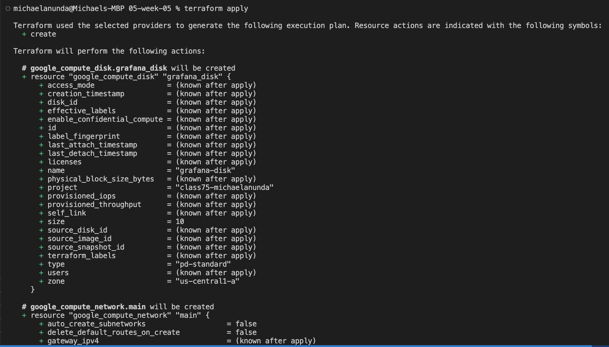

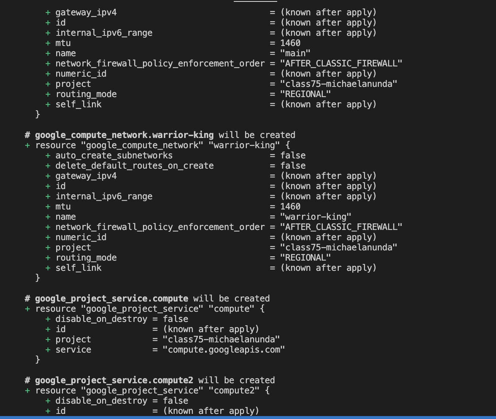

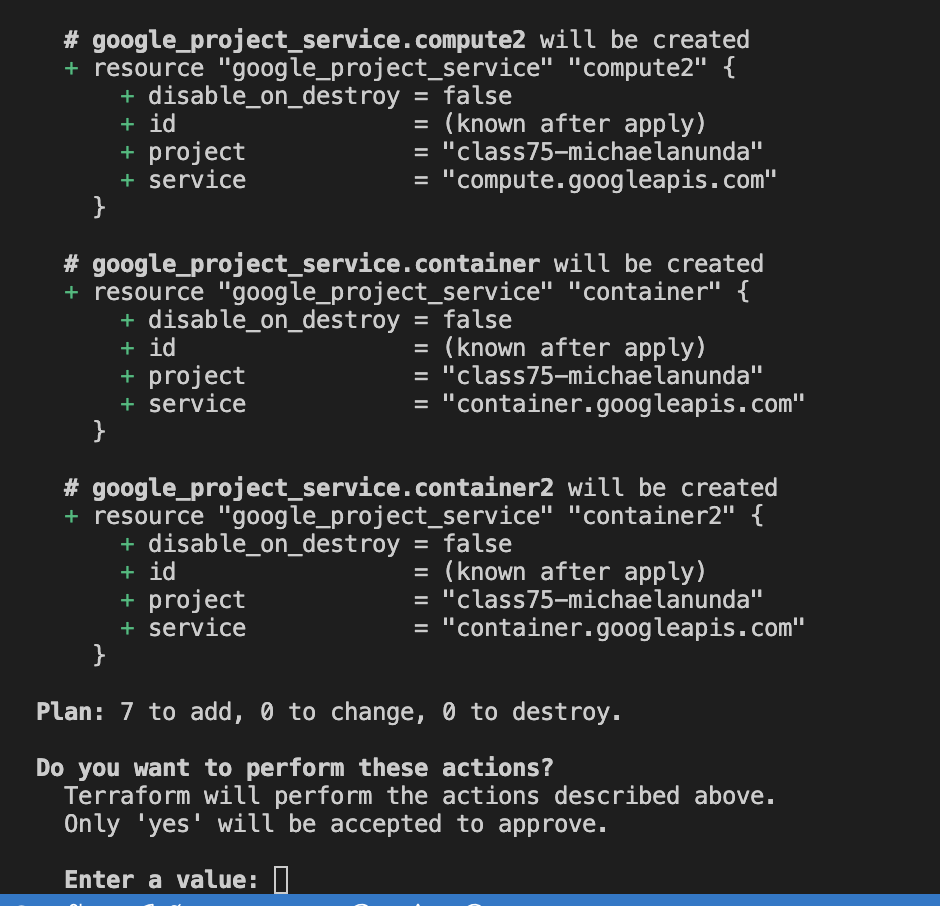

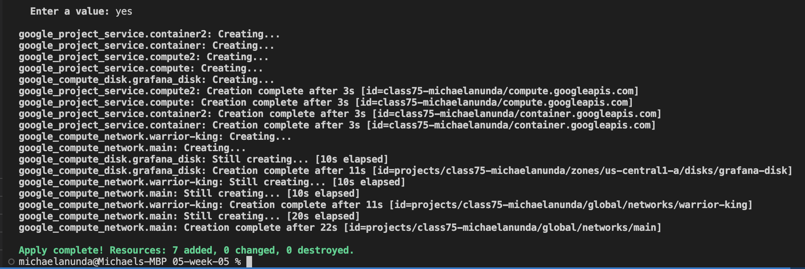

After apply, verify resources in GCP:

```bash
gcloud compute disks list --project=class75-michaelanunda
```

```bash
gcloud compute networks list --project=class75-michaelanunda
```

---

## Deployment Instructions for Terraform Destroy

Destroy the Terraform-managed resources:

```bash
terraform destroy
```

When prompted, type:

```text
yes
```

Terraform destroy removes the resources managed by the current Terraform state.

Execution evidence:

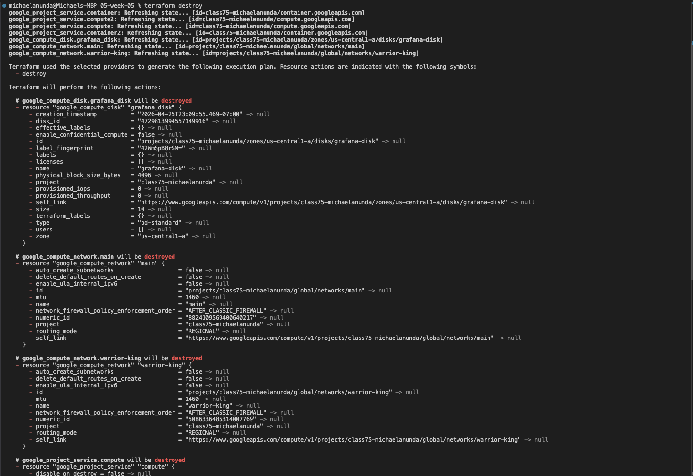

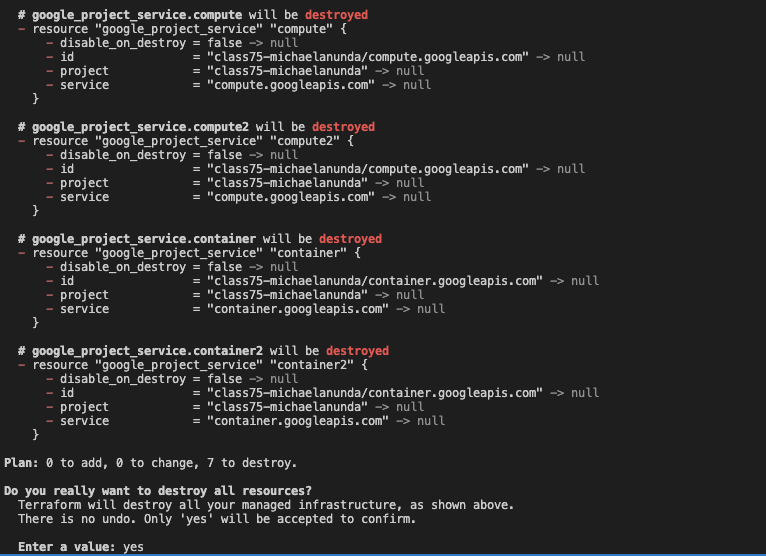

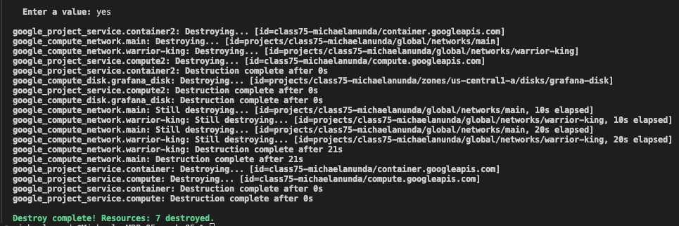

After destruction, verify that the lab resources are no longer present:

```bash
gcloud compute disks list \
  --project=class75-michaelanunda \
  --filter="name=grafana-disk"
```

```bash
gcloud compute networks list \
  --project=class75-michaelanunda \
  --filter="name:(main OR warrior-king)"
```

Expected result: no matching lab resources should remain.

---

## Execution of the Linux Command `date && hostname && whoami`

After `terraform destroy` completes and the resources are confirmed removed from GCP, run the following command from Git Bash for Windows or Terminal for macOS/Linux:

```bash
date && hostname && whoami
```

This command records:

- the date and time of execution,
- the local host where the command was run,
- the local user account that executed the command.

Execution evidence:


---

## Layout of the Repository

```text
05-week-05/
├── .gitignore
├── 0-authentication.tf
├── 1-backend.tf
├── 2-vpc.tf
├── README.md
└── deliverables/
    ├── 1_terraform_init.png
    ├── 2_terraform_validate.png
    ├── 3_terraform_plan_1.png
    ├── 3a_terraform_plan_2.png
    ├── 4_terraform_apply_1.png
    ├── 4a_terraform_apply_2.png
    ├── 4b_terraform_apply_3.png
    ├── 4c_terraform_apply_4.png
    ├── 5_terraform_destroy_1.png
    ├── 5a_terraform_destroy_2.png
    ├── 5b_terraform_destroy_3.png
    └── 6_date_hostname_whoami.png
```

---

## Engineering Philosophy from this Lab

This lab reinforces a practical infrastructure engineering principle: infrastructure should be reproducible, observable, reviewable, and disposable.

Terraform provides the reproducibility. The `.tf` files define the desired state of the infrastructure in version-controlled code. Any engineer reviewing the repository can inspect the provider configuration, backend configuration, API enablement, persistent disk, and VPC definitions before deployment.

The IVPAD workflow provides operational discipline. `terraform init` prepares the environment, `terraform validate` checks correctness, `terraform plan` creates a reviewable execution preview, `terraform apply` performs the deployment, and `terraform destroy` proves the environment can be torn down cleanly.

The screenshots provide audit evidence. They show not only that commands were executed, but also that the resulting terminal output was captured at each stage of the lifecycle. This is important for technical labs, compliance-oriented workflows, peer review, and operational traceability.

The final `date && hostname && whoami` command adds local execution context. It ties the lab evidence to a specific timestamp, host, and user context after the cloud resources have been destroyed.

The larger engineering lesson is that cloud infrastructure should not be treated as a collection of manual console actions. It should be defined as code, reviewed before execution, deployed through a controlled workflow, verified after creation, and destroyed when no longer needed.