## Q & A (DNS and SSL/TLS, Load Balancers, and Cloud Domain/DNS):

## DNS and SSL/TLS

    Q1 - Explain what the traceroute and dig commands do. Compare and contrast.
    A1 - The traceroute command is a network diagnostic tool that shows the path data packets take from your computer to a destination. It displays each hop along the route and measures the round-trip time for packets at each hop. The dig command retrieves information about DNS name servers and DNS records. It is used to troubleshoot DNS problems and perform DNS lookups.
    
    Resource/Documentation/Reference - https://www.geeksforgeeks.org/linux-unix/traceroute-command-in-linux-with-examples/ AND (Link 2) => https://www.geeksforgeeks.org/linux-unix/dig-command-in-linux-with-examples/
    How Resource/Documentation/Reference was used - (Link 1) => Leveraged the content underneath the header "Traceroute Command in Linux with Examples" AND (Link 2) => Leveraged the content underneath the header "dig Command in Linux with Examples"


    Q2 - What are the 3 or 4 most common DNS records and what are their use cases? 
    A2 - The 4 most common DNS records are A, AAAA, CNAME, and MX. These DNS records have the following use case: 1. DNS A records map domain names to their corresponding IPv4 addresses, 2. DNS AAAA records map domain names to their corresponding IPv6 addresses, 3. DNS CNAME records map an alias or subdomain to another domain name, and 4. DNS MX records specify the mail servers responsible for receiving email sent to a domain, usually with priority values that determine delivery order.
    
    Resource/Documentation/Reference - https://qrator.net/library/learning-center/DNS/What-Are-DNS-Records/?utm_referrer=https%3A%2F%2Fwww.google.com%2F#dns-cname-records
    How Resource/Documentation/Reference was used - Leveraged the content under the headers "DNS A records", "DNS AAAA records", "DNS CNAME records", and "DNS MX records"


    Q3 - Give an overview of the steps in a TLS handshake.
    A3 - Phase 1 Hello Exchange: The client sends the host server a ClientHello message containing the client's supported TLS versions, a list of compatible cipher suites, and a string of random bytes. The host server responds to the client's ClientHello message with a ServerHello that contains a mutually supported TLS protocol version and cipher suite. This phase sets the foundation for the TLS handshake between the client and host server.

    Phase 2 Server Authentication and Key Exchange: Post Phase 1 Hello Exchange, the host server sends the client its digital certificate and the client validates it using the certificate chain and related checks. In TLS 1.2, depending on the cipher suite, the client may then send a premaster secret encrypted with the server’s public key, or perform a Diffie-Hellman-style key exchange. In TLS 1.3, key establishment uses ephemeral Diffie-Hellman-based exchange to derive shared secrets, rather than encrypting a premaster secret with the server’s public key.

    Phase 3 Finalizing the Secure Channel: Post Phase 2 Server Authentication and Key Exchange, the client and the host server calculate the master secret and the resulting session keys. The client sends the host server a ChangeCipherSpec message to indicate that subsequent data that is sent between the two will be encrypted under the negotiated keys. Finally, the client and the host server exchange finished messages which verify the handshake transcript and confirm that both sides derived the same keys. If these checks succeed, the TLS handshake is complete (both sides saw the same handshake transcript and key material, strongly indicating that the handshake was not tampered with) and the channel between the client and host server is ready for encrypted communication.

    Note the 3 phases described above are associated with TLS 1.2 Handshake. TLS 1.3 Handshake has a different process
    
    Resource/Documentation/Reference - https://www.paloaltonetworks.com/cyberpedia/what-is-a-tls-handshake
    How Resource/Documentation/Reference was used - Leveraged the content underneath the header "How the TLS Handshake Works: Step-by-Step"


    Q4 - How does an SSL/TLS cert know what domain it belongs to?
    A4 - A SSL/TLS cert knows what domain belongs to it via the Subject Alternate Name (SAN) field within the SSL/TSL cert itself
    
    Resource/Documentation/Reference - https://support.dnsimple.com/articles/what-is-common-name/
    How Resource/Documentation/Reference was used - Leveraged the content underneath the header "Common Name vs Subject Alternative Name"


    Q5 - What is a certificate authority?
    A5 - A certificate authority is a trusted organization that issues and signs digital certificates to verify the identify of websites for businesses, individuals, etc.
    
    Resource/Documentation/Reference - https://www.digicert.com/blog/what-is-a-certificate-authority
    How Resource/Documentation/Reference was used - Leveraged the content underneath the first paragraph

## Load Balancers

    Q1 - How do application load balancers in GCP offload (decrypt) SSL? What part of the load balancer does this?
    A1 - Application load balancers in GCP offload (decrypt) SSL via a feature called SSL offloading (TLS offloading being the modern term). The part of the load balancer that performs SSL/TLS offloading is the Google Front Ends (GFEs) or Envoy proxies (depending on the type of load balancer in GCP)
    
    Resource/Documentation/Reference - https://cloud.google.com/load-balancing, https://www.huntress.com/cybersecurity-101/topic/ssl-offloading, and https://docs.cloud.google.com/load-balancing/docs/target-proxies
    How Resource/Documentation/Reference was used - (Link 1) => Referenced the content under the header "SSL offload", (Link 2) => Referenced the content under the header "TLS Offloading vs. TLS Termination", and (Link 3) => Referenced the content under the header "Target proxies overview"


    Q2 - Are there use cases to have in flight encryption from the backend service to the backend itself?
    A2 - Yes. Example use cases are as follows: 1. An encrypted connection (that is auditable) from the load balancer (or Cloud Service Mesh) to thee backend instances and 2. When the load balancer connects to a backend instance that lives outside of GCP (via an internet NEG)
    
    Resource/Documentation/Reference - https://docs.cloud.google.com/load-balancing/docs/ssl-certificates/encryption-to-the-backends
    How Resource/Documentation/Reference was used - Referenced the content under the header "Secure backend protocol use cases"

## Cloud Domain/DNS

    Q1 - Can multiple domains end up pointing to the same LB?
    A1 - Yes. This is done by the URL map (a component of a LB) inspecting the host header and routing to different backend services based on the hostname.
    
    Resource/Documentation/Reference - https://oneuptime.com/blog/post/2026-02-17-how-to-implement-host-based-routing-for-multi-tenant-applications-on-gcp-load-balancer/view and https://groups.google.com/g/gce-discussion/c/gXHAzSC0kMM?pli=1
    How Resource/Documentation/Reference was used - (Link 1) => Referenced the content under the header "Architecture" and (Link 2) => Referenced the content under the response from "Kamran (Google Cloud Support)"


    Q2 - In the context of Cloud DNS, what are zones?
    A2 - In the context of Cloud DNS, zones are representations of domain namespaces that are managed by Cloud DNS. The two types of zones are supported: 1. Public Zones: Resolves domain names accessible over the internet and 2. Private Zones: Used for internal domain name resolution within a Virtual Private Cloud (VPC). Finally, each respective zone contains DNS records associated with the domain (e.g., A, AAAA, MX, CNAME records)
    
    Resource/Documentation/Reference - 1. https://www.geeksforgeeks.org/cloud-computing/google-cloud-dns/, 2. https://docs.cloud.google.com/dns/docs/overview, and 3. https://docs.cloud.google.com/dns/docs/zones/zones-overview
    How Resource/Documentation/Reference was used - (Link 1) => Referenced the content under the header "1. DNS Zones", (Link 2) => Referenced the content under the third paragraph, and (Link 3) => Referenced the content under the first paragraph

## Runbook:

    End Goal:

    Troubleshoot and repair a VM that does not work correctly, create a runbook so in the future when engineers are drunk it is easier to troubleshoot. Document all methods used even if they did not find the current issue as they may be helpful in the future.


    Support Ticket:

    Initial observations: VM was stopped. When VM was started up the VM did not have an external ip. Discoverd that the VM is not reachable via http after assigning an ephemeral ip to the VM. Within the VMs ssh session was not able to ping 8.8.8.8 - Checked vpc firewall rules and noticed that the highest priority firewall rule is a Deny All which allows no access to resources that live within the VPC

    Expected behavior: VM should be reachable via http after it was started. In addition, the VM should already have an external ip assign to it after it has been booted and there should not be a firewall rule with the highest priority to deny all access to the VPC

    Root causes of the issue:

    1. VM was in a stopped state (needs to be started)
    2. VM only has network tag related to the firewall rule for ssh access (ssh-access) but does not have the network tag related to the firewall rule for http access (http-server) (this tag needs to be assigned to the vm)
    3. VM does not have an ephemeral ip address attached to it (assign to to the VM in the settings via the network interface)
    4. Deny-All firewall rule (homework-deny-all) has highest priority (0) (needs to be deleted)
    5. fire wall rule for ssh (homework-allow-ssh) only allows access to the ip address 1.2.3.4 (1.2.3.4/32) (open this up to any ip address via 0.0.0.0/0)
    6. There is no established route within the VPC to the internet gateway

    Please reference the anti-drunk engineer runbook below ⬇️

    Prerequisites:
    - Google Cloud Platform account
    - Billing enabled (free tier is sufficient)
    - Compute Engine API enabled
    - gcloud properly configured
    - Google Cloud Shell (properly configured within GCP) or local terminal (bash/zsh/git bash) with curl (curl --version)

    Follow these Steps:
    - Provision the broken environment by executing the following bash command in either GCP cloud shell or your local terminal (bash/zsh/git bash)
```bash
curl -s https://storage.googleapis.com/static-site-bucket-522479235074/broken-env-with-prechecks-v2.sh | bash
```

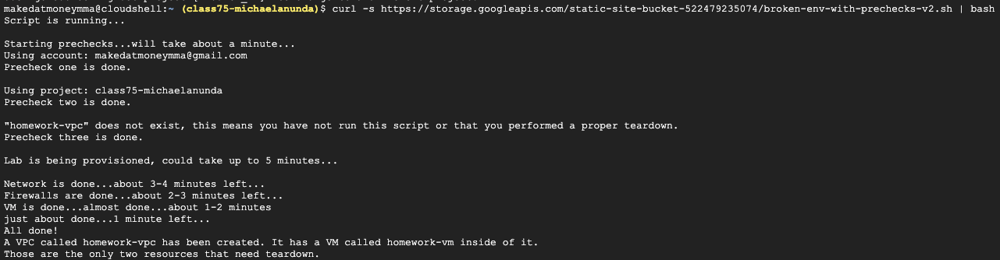

    - Type VM instances in the search bar within the GCP Console and then click VM instances
        1. Observation 1 - The vm instance is stopped
            * Select the VM then click Start/Resume
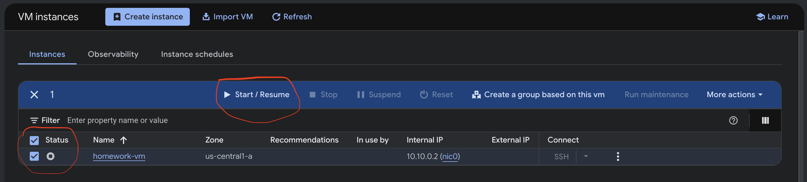

        2. Observation 2 - The vm instance does not have an external IP, and not sure if SSH works or not
            * Click SSH
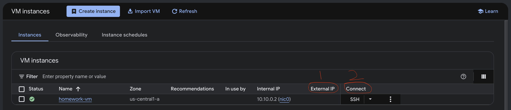
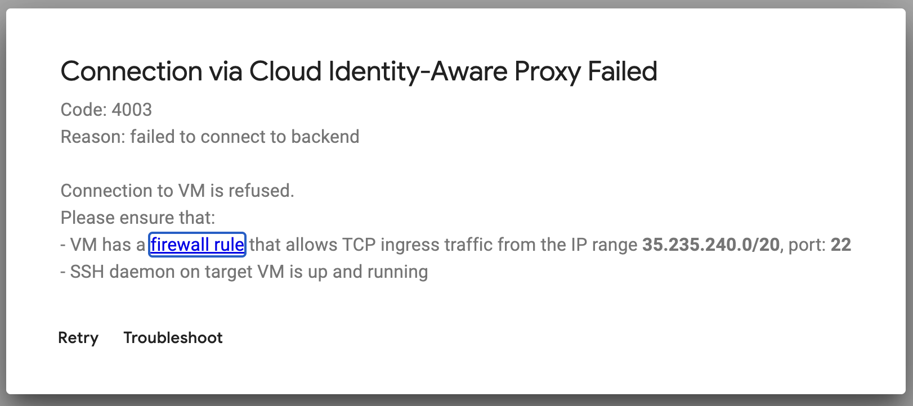
            ⬆️ Confirmation that SSH is not working on this VM

        3. Observation 3 - So far the VM has no external IP and SSH is not working
            * Go back to the vm instance dashboard, click the three vertical dots, then select View network details
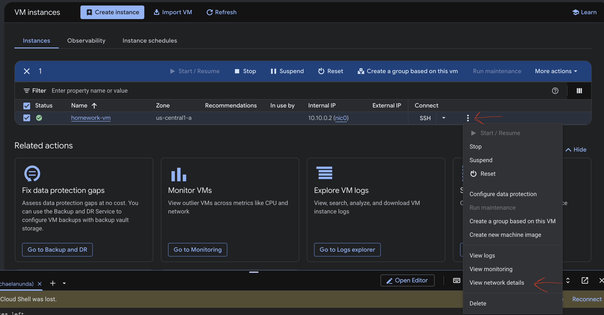

        4. Observation 4 - Several things stick out within the Network interface details menu
            * No External IP address under Network interface details
            * Network tags is listed as ssh-access under VM instance details
            * Under VPC firewall rules, the highest priority firewall rule is homework-deny-all (possibly explains why the vm can't be accessed via ssh earlier)
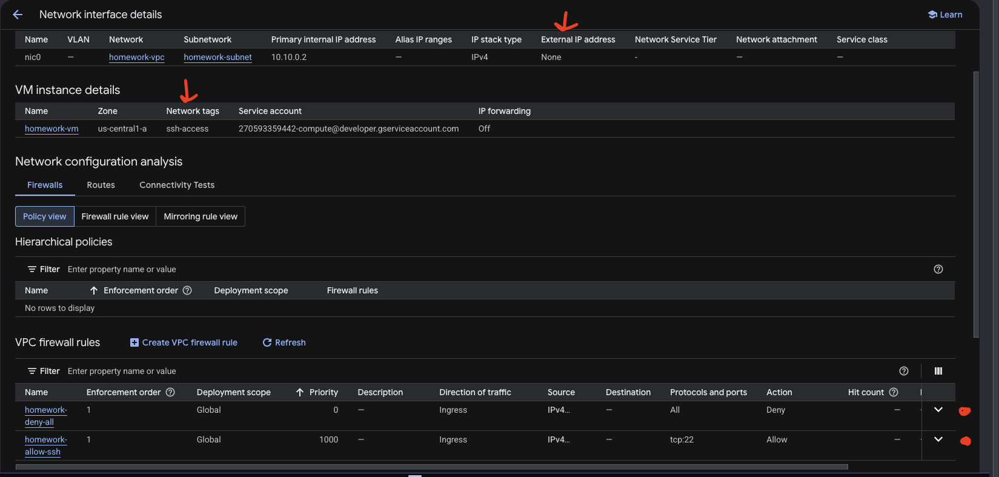
            
            * Next step is to open a new tab, go to the GCP console, type VPC networks in the search bar within the GCP Console, and then click VPC networks
            * Click homework-vpc, go to Firewalls, PAUSE => there is a firewall rule for http (homework-allow-http), so it seems like this firewall rule did not apply to the vm due to its Network tag ssh-access (keep this in mind)
            * Back on track, click the firewall rule homework-deny-all, then click Delete (with this action http and ssh traffic can now reach the vm, but we're not out of the woods yet)
            * Click the firewall rule homework-allow-ssh, click Edit, then change the Source IPv4 ranges field from 1.2.3.4/32 to 0.0.0.0/0, then click Save (previously, the Source IPv4 of 1.2.3.4/32 limited SSH access to the VM only to IP address 1.2.3.4 - with 0.0.0.0/0 this opens up all possible IPv4's to access the VM via SSH)

            * Next step is to go back to the tab for the vm instance and click SSH (want to check if the VM is now accessible via SSH)

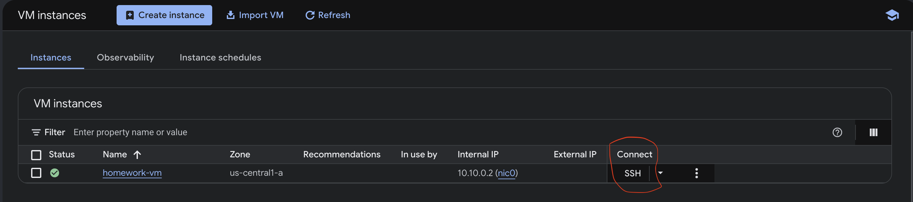

            5. Observation 5 - The vm can now be accessed via SSH, but when you execute the command ping 8.8.8.8 the ping is not streaming (will circle back to this after several steps)

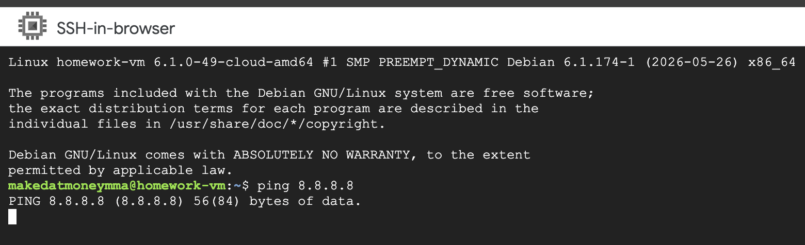

            * Next step is to go back to the tab for the vm instance and click the name of the instance, then click edit

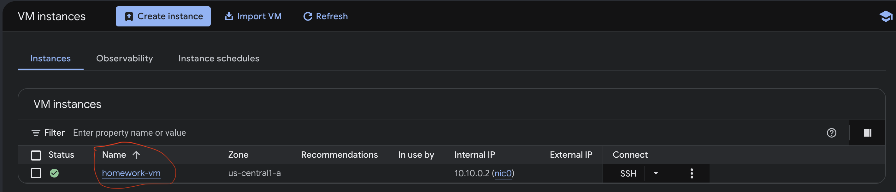
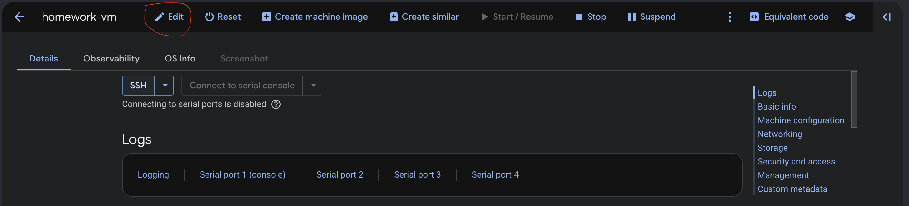

            6. Observation 6 - External IPv4 address is set to None, Allow HTTP traffic is unchecked, and Network tags does not have http-server
                * Select Ephemeral under the External IPv4 address field
                * Check Allow HTTP traffic under Firewalls
                * Add http-server to the Network tags field (this will be done for you right after you check Allow HTTP traffic under Firewalls)

                 
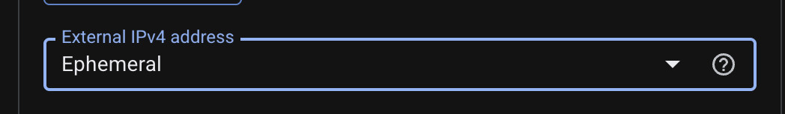
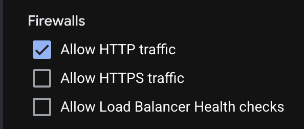
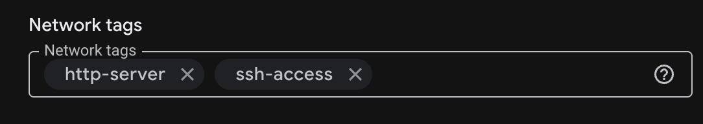

                * Click Save
                * Go back to the main dashboard for the vm instance

            7. Observation 7 - Tried to access the external ip address of the vm via the browser but I can not access it. In addition, tried executing the shell command ping 8.8.8.8 (again) but it is not streaming output in the ssh shell of the vm

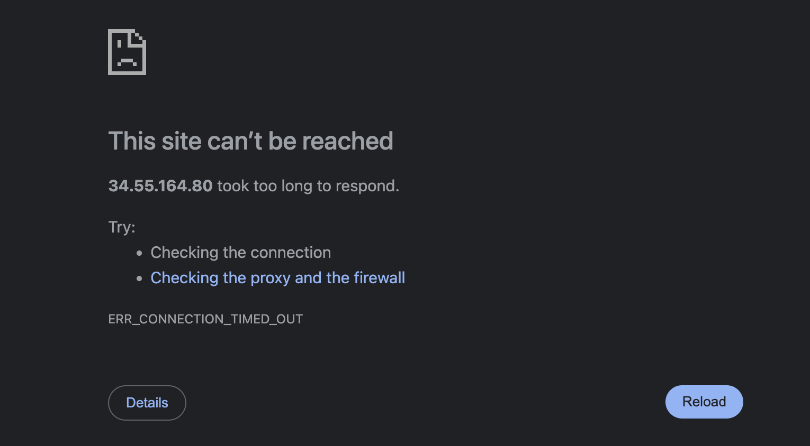


                * Go back to the vm instance dashboard, click the three vertical dots, then select View network details


                * Under Network configuration analysis, click Connectivity Tests the click Create (if GCP ask to enable the api then do this first then create the Connectivity Test)

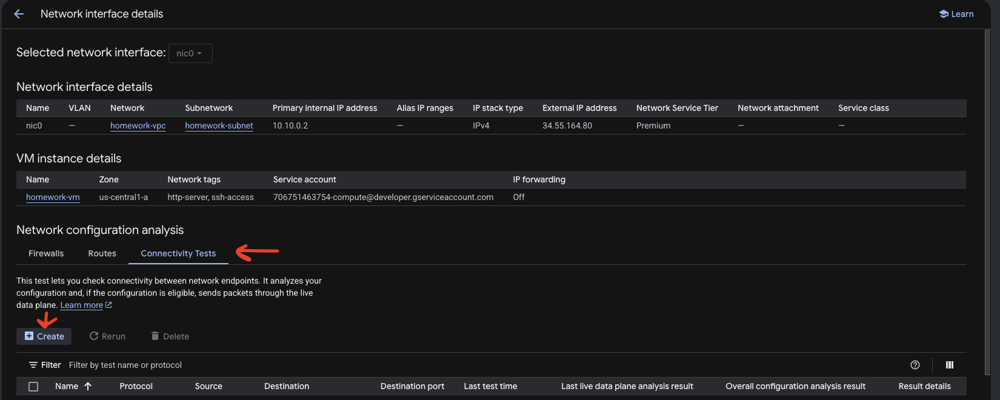

                * Under Create Connectivity Test, fill in the fields as shown in the image below and click Create (note - the Destination IP address should be the External IP address)

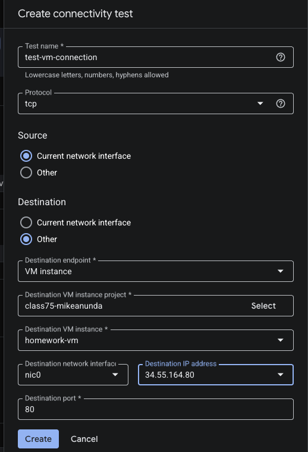

                * Once the test is done running click View under Result details (the results will show that the external ip of the vm is not reachable)

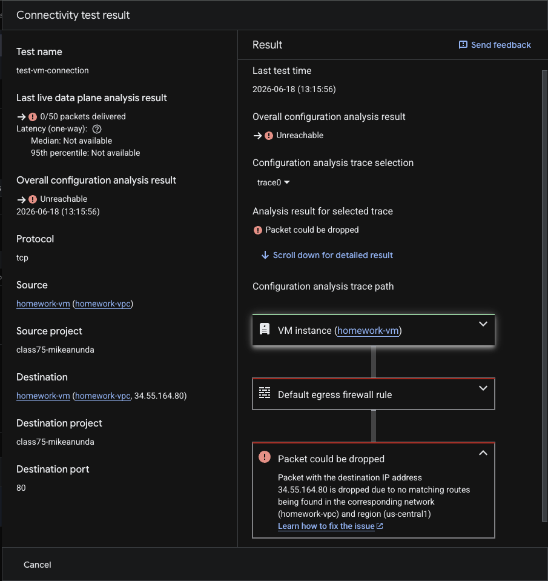

                * Under Network configuration analysis, click Routes

            8. Observation 8 - There is not a route to the internet gateway for the vpc (homework-vpc). I'm suspecting this is the reason why the vm can't be reached via http or ping 8.8.8.8 within the ssh shell of the vm

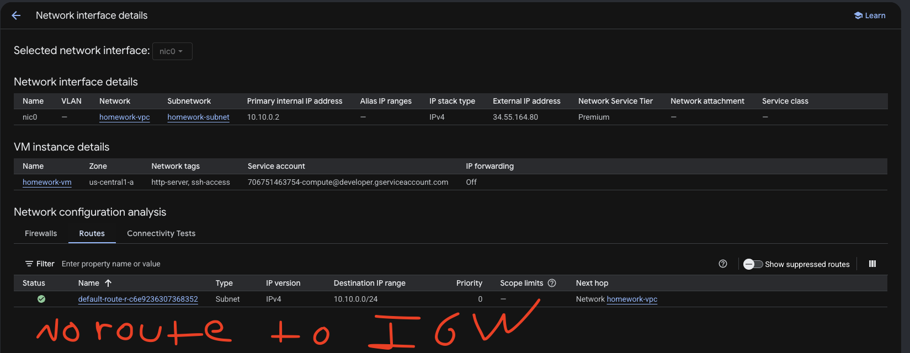

                 * Go back to the tab for the vpc and make sure you are in the VPC networks page (you get there by 1. type VPC networks in the search bar within the GCP Console and 2. click VPC networks)
                 * Within the VPC networks page, click Routes on the left pane
                 * Click Route management then click Create route
                 * Under Create a route, fill in the fields as shown in the image below and click Create

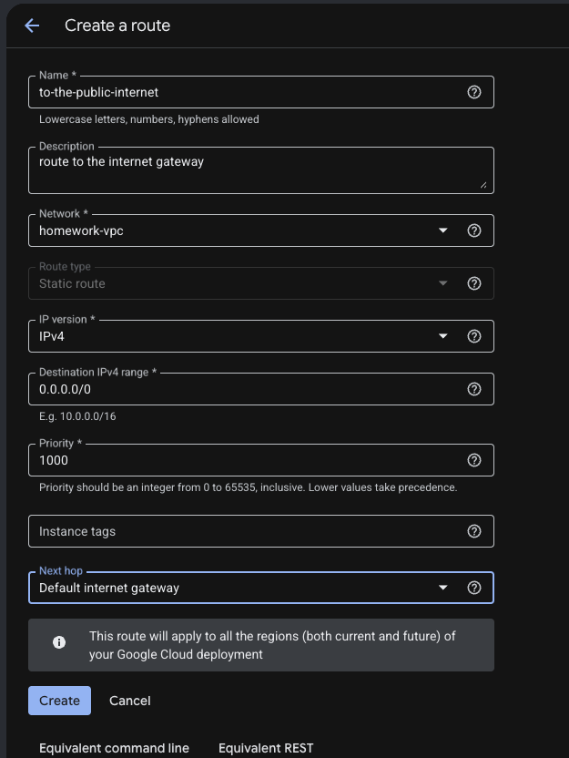

                * Go back to the tab for the vm and make sure you are in the Network interface details (you get there by 1. type vm in the search bar within the GCP Console, 2.click VM instances, 3. click the three vertical dots, and 4. select View network details)
                * Under Network configuration analysis, click Routes and make sure the route to the internet gateway is populated

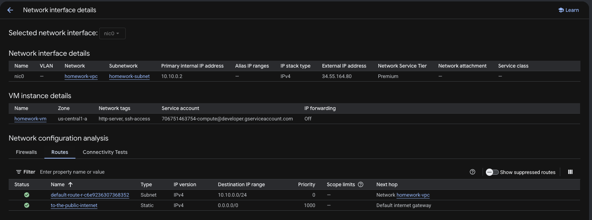

                * Under Network configuration analysis, select the existing test, then click Rerun

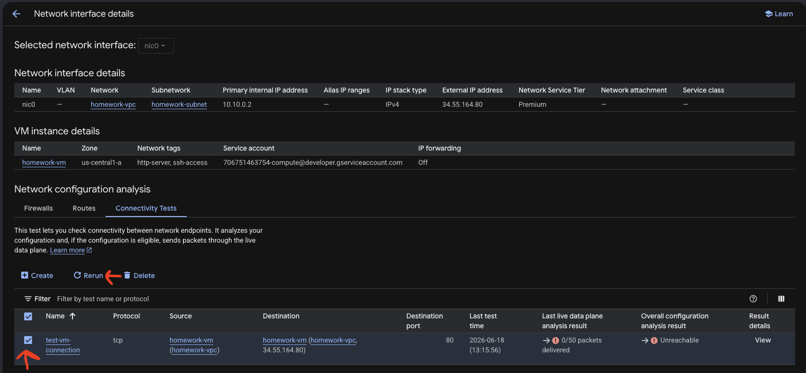

                * Looks like the vm is reachable per the passed test on rerun (you can see more details by clicking View under Result details)

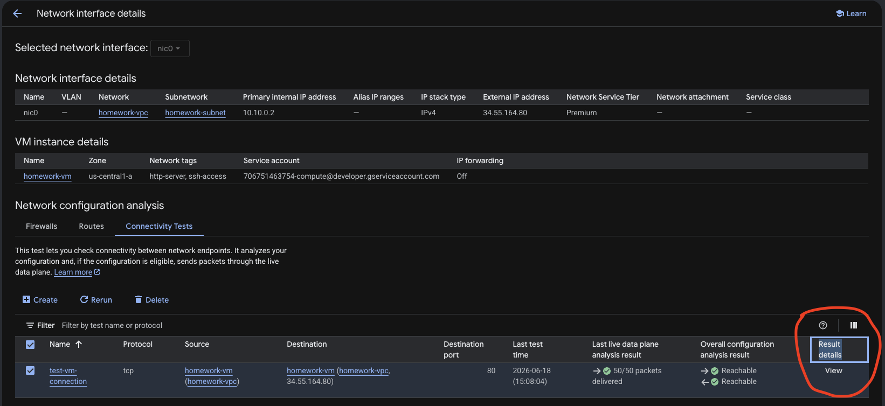

                * Go back to the main dashboard for the vm instance (you get there by 1. type vm in the search bar within the GCP Console and 2.click VM instances), click the check box for the vm, and click Reset

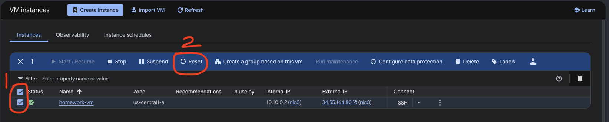

                9. Observation 9 - The vm can now be reached by its external ip and within the ssh of the vm the command ping 8.8.8.8 is streaming

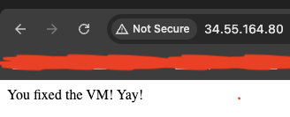
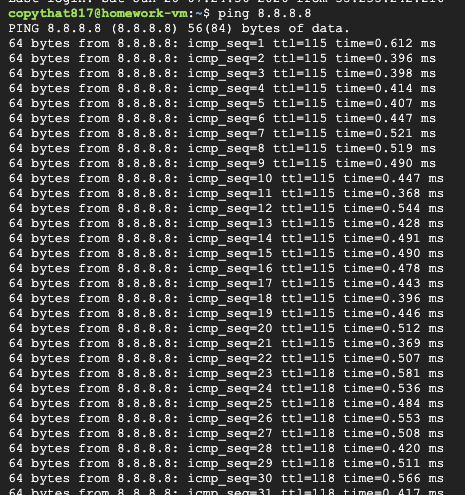