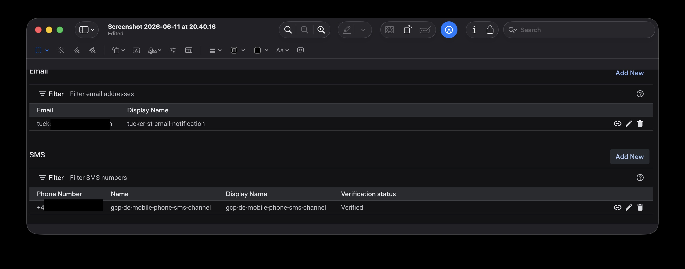
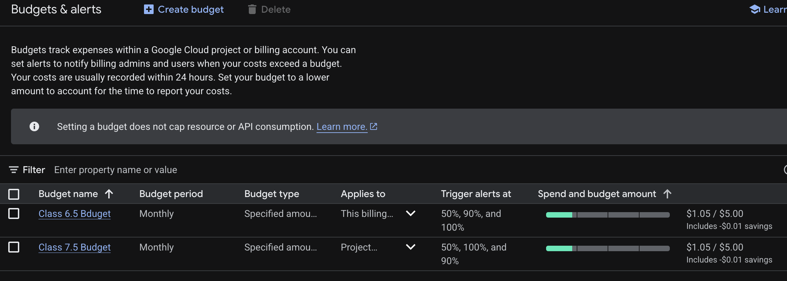

# GCP FinOPS Guide

## Purpose
This document provides a guide to setting up FinOps practices in Google Cloud Platform (GCP). It covers the following topics: Cloud Notifications, notification alerts, budget alerts, and SMS notifications for budget usage. The primary focus is on using an email account to receive notifications, but it also includes steps to set up SMS notifications for budget usage.

## Cloud Notifications in GCP
Cloud notifications in GCP allow you to receive alerts and updates about your cloud resources and services. These notifications can help you stay informed about the status of your resources, monitor usage, and manage costs effectively. Basically its a easy way to stay on top of what is going on in your GCP project(s) without having to constantly check the console.

- Create a Notification Channel
1. Go to the GCP Console, Observability Monitoring > Detect > Alerting.
2. Click on "Edit Notification channels" in the top of the page.
3. Scroll down to the channel you want to set up (e.g., Email or SMS) and select "Add New"
4. Follow the prompts to set up your notification channel, including entering the necessary contact information (e.g., email address or phone number).

[!NOTE] When setting up the SMS channel you will be required to verify the phone number you provided.

### Billing Alerts in GCP
Billing alerts in GCP allow you to set up notifications based on your billing and cost data. You can create budget alerts that notify you when your spending reaches certain thresholds, helping you manage your costs effectively. Basically it is an automated way to keep track of costs related to your GCP service usage. It is a good resource to use to help avoid excessive costs and stay on budget.

- Create a Budget in GCP
1. Go to the GCP Console and navigate to the "Budgets & Alerts" section.
2. Click on "Create budget" and follow the prompts to set up your budget.
4. Set your budget amount and specify the time period for the budget (e.g., monthly).
5. Configure the budget alerts by selecting the thresholds (e.g., 50%, 90%, 100%) and the notification channels (e.g., email).  

An example of a completed budget alert setup is presented below:

### Cloud Financial Operations (FinOps) in GCP
FinOps is a framework that seeks to merge financial management, business return on investment (ROI), and cloud operations to help organizations manage and optimize their cloud costs effectively. The goal of FinOps is to support organizations in making informed decisions concerning their cloud utilization and operational expenses while also seeking to maximize efficiency and value from their investment in cloud resources.

Basically, FinOps is a set of practices and tools that help organizations manage their cloud costs effectively. It involves monitoring usage, optimizing resources, and implementing cost-saving strategies to ensure that the organization is getting the most value from its cloud investment.

In this weeks Classic VPN lab, we setup a VPN between two GCP projects in two geographical regions. This simulated what is accomplished in real world scenarios, adding encryption to all traffic between a multi-site or multi-cloud architecture. This type of setup helps deliver confidentiality of data in transit between the two projects. 

However, it is important to monitor the costs associated with this setup, as VPNs can incur additional costs based on data transfer and usage. By implementing FinOps practices, you can ensure that you are optimizing your VPN usage and managing costs effectively while maintaining the necessary security and performance for your applications.