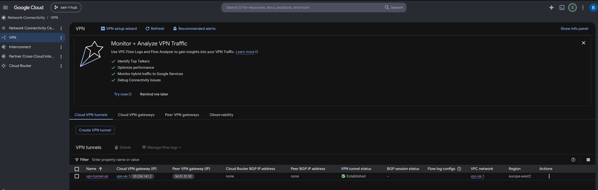
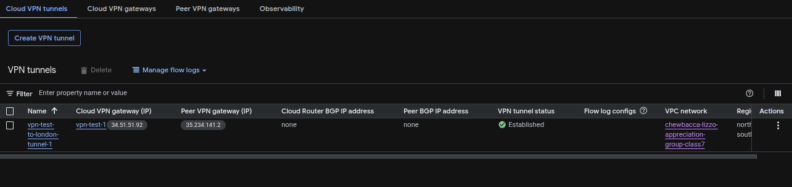
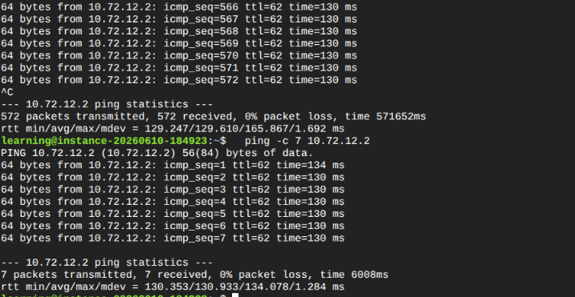
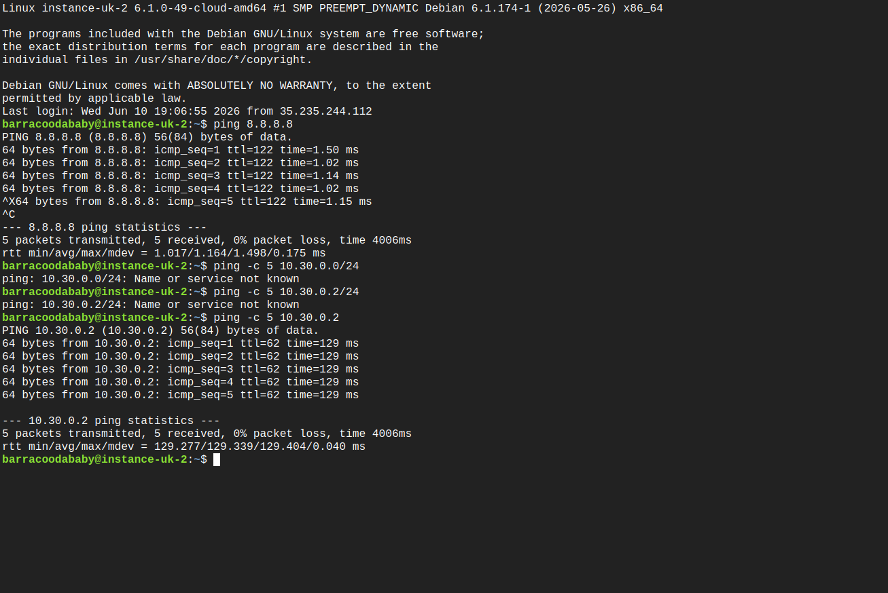

## GCP Classic VPN Assignment

### Purpose
This group assignment covers two separate topic areas in the Google CLoud Environment:

1. GCP Classic VPN
GCP Classic VPN and associated components. The assignment is to create a VPN connection between two GCP projects, and to test the connectivity between the two projects.

A runbook was created to document the steps taken to complete the assignment. The runbook includes examples of the workflow and covers manual deployment, testing and teardown of the VPN and other resources.

The runbook is in a separate document named `GCP_Classic_VPN_Assignment_Runbook.md`. Please refer to that document for detailed instructions and examples.

2. FinOps
FinOps is the practice of managing and optimizing cloud costs. The assignment is to setup project Cloud Notifications, notification alerts and budget alerts create SMS notifications for budget usage. Primary focus is to use an email account to receive notifications, but also to setup SMS notifications for budget usage.

### Screenshots

Example screenshots of successful deployment and testing of the VPN connection are presented here:

[!NOTE] The screenshots in this example are with one site in GCP Mexico and the other in GCP UK. Steps to create the VPN connection and test connectivity are the same regardless of the regions used.

* Successful VPN connection between GCP Mexico and GCP UK

* Successful ping test between GCP Mexico and GCP UK

* Firewall rules allowing ICMP traffic between GCP Mexico and GCP UK

[!firewall-rules](./screenshots/uk-firewall-rules.png)
