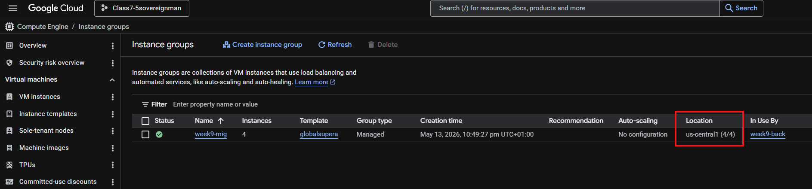
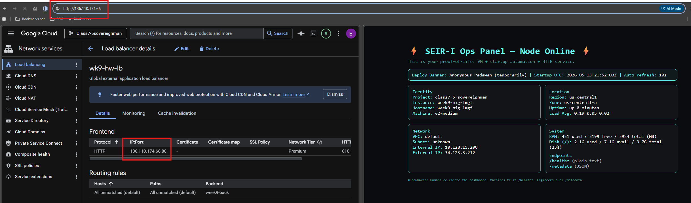
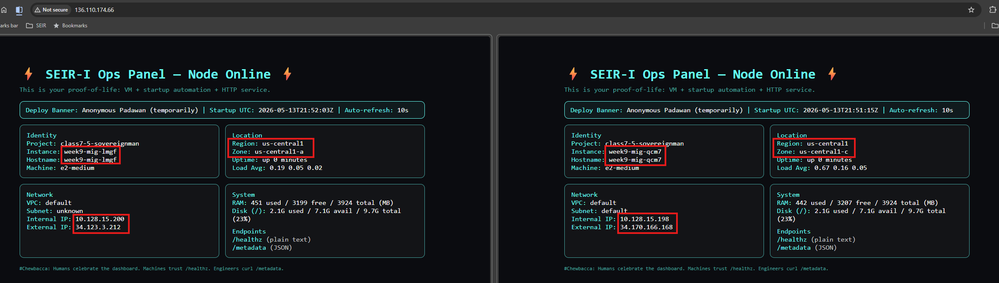
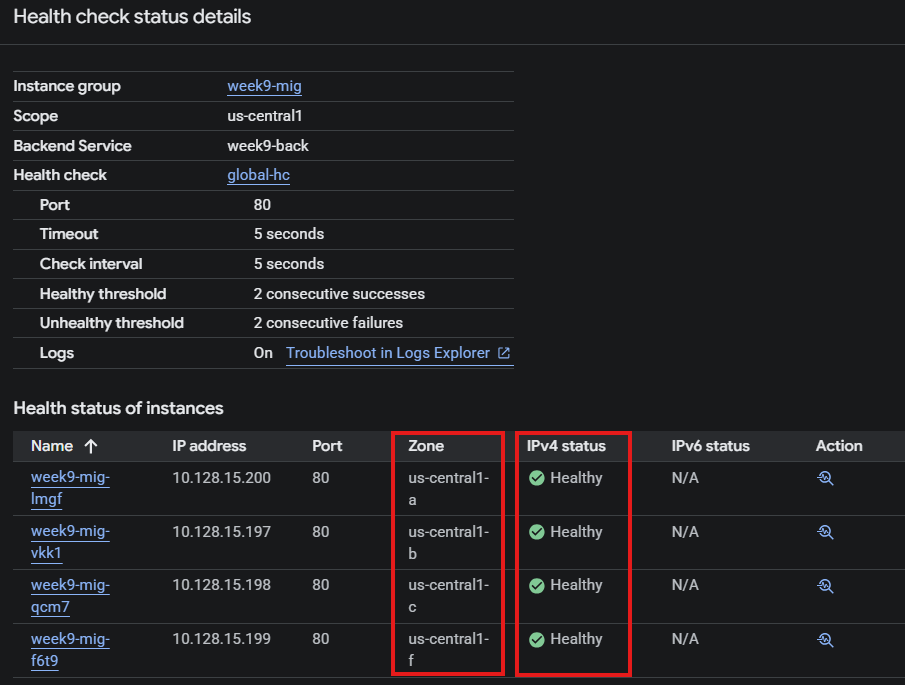

# Runbook: Deploy a Global External Application Load Balancer with a MIG Backend (ClickOps)

## End Goal

Deploy a global HTTP load balancer that distributes incoming traffic across a managed instance group (MIG) of 4 web server VMs distributed across all zones in `us-central1`. The load balancer will use a health check to route traffic only to healthy VMs.

## Prerequisites

- GCP project with billing enabled
- Existing instance template named `globalsupera` with:
  - `Allow HTTP traffic` checked (enables `http-server` tag)
  - Startup script
- Existing health check named `global-hc` (HTTP, port 80) — or create one as part of this runbook

---

## Procedure

### Part 1: Create the Managed Instance Group (MIG) Backend

- Go to **Compute Engine → Instance Groups**
- Click **Create instance group**
- **Name:** `week9-mig`
- **Instance template:** `globalsupera`
- **Number of instances:** `4`
- **Location:** **Multiple zones**
- **Region:** `us-central1`
- **Zone selection:** Select ALL available zones (`a, b, c, f`)
- **Auto‑healing:** Select `global-hc` (or create it: HTTP, port 80, regional scope, logs on, default thresholds)
- Click **Create**

---

### Part 2: Create the Global External Application Load Balancer

#### 2.1 Start creation

- Go to **Network Services → Load balancing**
- Click **Create load balancer**
- **Type:** **Application load balancer (HTTP/HTTPS)**
- **Public facing** (Internet facing)
- **Global or single region:** **Global**
- **Load balancer generation:** **Global external application load balancer**
- Click **Configure**

#### 2.2 Frontend configuration

- **Name:** `week9-front`
- **Protocol:** HTTP
- **Port:** 80
- **IP address:** Ephemeral (GCP assigns automatically)
- **Advanced features:** Leave defaults

Click **Done**.

#### 2.3 Backend configuration

- Click **Backend configuration**
- Click **Create a backend service**
- **Name:** `week9-back`
- **Backend type:** **Instance group**
- **Protocol:** HTTP
- **Named port:** HTTP
- **Timeout:** 30 seconds
- **Health check:** Select `global-hc`
- Under **Backends**, click **New backend**
- **Instance group:** `week9-mig`
- **Port number:** `80`
- **Balancing mode:** **Rate**
- **Maximum RPS:** `10`
- **Capacity:** `100`
- **Cloud CDN:** Disable 
- **Cloud Armor:** Keep default
- Click **Create**

**Why Rate mode with 10 RPS?** When testing, Rate mode makes the load balancer switch backends more noticeably. In production, you might use Utilization with CPU targets.

#### 2.4 Backend bucket (for static content)

- **Name:** `week9-bucket`
- **Cloud Storage bucket:** Click **Browse** then Select an existing bucket (or create one)
- **Cloud CDN:** Disable

Add this only if you have static files (images, CSS, JS) to serve separately.

#### 2.5 Routing rules

- Click **Simple Host and path rules**
- Ensure only **one default backend rule** exists (delete any extra rules like `host2/path2`)
- **Default backend** should be `week9-back`

#### 2.6 Review and create

1. Click **Review and finalize**
2. Verify the configuration summary
3. Click **Create**

Wait 2-3 minutes for the load balancer to provision.

---

## Verification

- After creating MIG, make sure under **Location** it shows 4/4. This makes sure VMs are created in all selected zones.

- **Load balancer IP:** From Load Balancer details page → Frontend section → copy the IP address.
- **Web page loads:** Visit `http://<IP>` in a browser. (IP should not include the Port number) You should see the web server response.

- **Traffic distribution:** Refresh the page several times; if the hostname/IPs/Location changes, traffic is moving between VMs.

- **Multi‑zone distribution:** Instance Group → Instances tab — VMs should be spread across `a, b, c, f`.
- **Health check status:** Instance Group → all VMs show green (healthy).

---

## Clean up (After Testing)

1. Delete the **load balancer** (Load Balancing → select `wk9-hw-lb` → Delete)
2. Delete the **backend service** `week9-back` (if not auto‑deleted)
3. Delete the **instance group** `week9-mig` (Instance Groups → select → Delete)
4. (Optional) Delete the **health check** `global-hc` and **instance template** `global-super-a`

> **Why this order:** Resources that depend on others must be removed from the top down.

---
