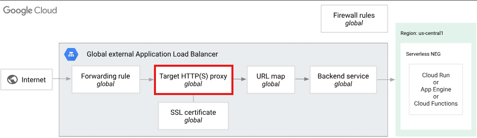
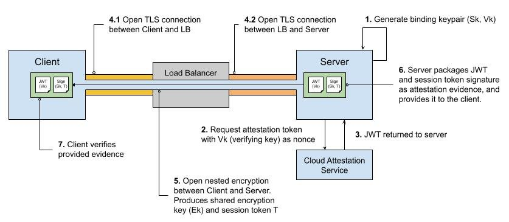

# Week 10 Q&A

## DNS and SSL/TLS

### Explain what the traceroute and dig commands do. Compare and contrast. 

**`traceroute` Path Discovery**  
This tool is a network path tracer.
Its a network troubleshooting tool that shows the path your data packets take from your device to a desired server.

The primary focus is L4 - IP Routing. Key use case is to find the source of network congestion or failure.

It does this by using a value in the IP packet header called **Time To Live (TTL)**. Every router the packet passes through reduces the TTL by one. When the TTL reaches zero, that router sends back a “Time Exceeded” message. By sending packets with TTL values of 1, then 2, then 3, and so on, traceroute gets each router along the path to identify itself, showing every hop the packet takes. This makes it very useful for finding where a network connection is slowing down or failing.    
https://help.mikrotik.com/docs/spaces/ROS/pages/130220138/Traceroute

**`dig` DNS Lookup**  
`dig` is a Domain Name System (DNS) troubleshooting tool. Its job is to query DNS and show how a domain name (like example.com) gets translated into the technical information needed to reach it, such as an IP address. Your browser does this automatically in the background, but `dig` shows you the raw DNS response, including DNS record types like A records, TTL values, and which authoritative name servers provided the answer.
The primary focus is L7 - Application layer - DNS resoltion.    
https://console9.com/wiki/guides/dns-debugging/

### What are the 3 or 4 most common DNS records and what are their use cases? 
DNS Records are the instruction set for a domain, telling the internet how to handle different types of requests. Four common records are:

**A Record (Address Record)**:  
The fundamental record of the DNS. It maps a domain name directly to an IPv4 address (e.g. `seir.com` = `93.184.216.34`). When you type a website name into your browser, the A record is what the DNS returns to direct your connection to the correct server.

**AAAA Record (IPv6 Address Record)**:  
This record does exactly what an A record does, but for the newer IPv6 protocol (e.g. `seir1.com` -> `2001:db8::1`).

**CNAME Record (Canonical Name Record)**:
Think of this as an alias for a domain name. Instead of pointing to an IP address, it points one domain to another. For example, you can create a CNAME record for `www.example.com` that points to `example.com`. This way, if the IP address of example.com ever changes, the `www` record automatically follows suit without needing to update.

**MX Record (Mail Exchange Record)**:
This record is for email routing. It specifies which mail servers are authorised to accept email messages on behalf of your domain.

https://controld.com/blog/dns-record-types/

### Give an overview of the steps in a TLS handshake.
  
https://www.ibm.com/docs/en/ibm-mq/9.0.x?topic=tls-overview-ssltls-handshake

The TLS handshake is the process that creates a secure and encrypted connection between a client and a server.
The TLS handshake is the behind-the-scenes negotiation that establishes a secure, encrypted connection between a client (like your web browser) and a server.  
Here is the classic TLS 1.2 sequence, which provides a clear breakdown of the roles and responsibilities:

**Step 1 — Client Hello**
The client (like a web browser) connects to the server and says which TLS versions and encryption methods (**CipherSuites**) it supports.

**Step 2 — Server Hello & Certificate**
The server chooses the TLS version and CipherSuite to use, then sends back its TLS certificate containing its public key.

**Step 3 — Certificate Verification**
The client checks that the certificate is valid, trusted, matches the website name, and has not expired.

**Step 4 — Key Exchange**
The client creates a secret value, encrypts it with the server’s public key, and sends it to the server.

**Step 5 - Secret Key Generation**  
Both sides now have the same three ingredients: client random, server random, pre‑master secret. They each compute the same session key (symmetric).

**Step 6 - Finished Messages**  
Client sends a "finished" message encrypted with the session key. Server replies with its own encrypted "finished" message.

### How does an SSL/TLS cert know what domain it belongs to?
The SSL/TLS certificate doesn't "know" anything. The domain name is written directly into it by the Certificate Authority (CA).

Steps:

1. **You request a certificate** for a specific domain (e.g., `www.seir.com`) and prove you control it (via DNS, file upload, etc.).
    
2. **The CA writes the domain name** into the certificate's **Subject Alternative Name (SAN)** field. A single certificate can list multiple domains (e.g., `seir.com`, `www.seir.com`, `mail.seir.com`).
    
3. **Your browser visits** `https://www.seir.com`. The web server presents its certificate.
    
4. **Your browser compares** the domain you typed (`www.seir.com`) against every domain listed in the certificate's SAN field.

Match? → Connection proceeds securely.  
No match? → Browser shows a security warning (potential man-in-the-middle attack).

### What is a certificate authority? 
A Certificate Authority (CA) is a trusted organization that issues and signs digital certificates, such as TLS/SSL certificates for websites. Its job is to verify that a website really belongs to the person or company claiming to own it. When a CA signs a certificate, it confirms that the website’s public key is legitimate. Web browsers and operating systems already trust well-known CAs, which is why your browser can automatically trust secure websites with valid certificates and know it’s connecting to the real site instead of an imposter.

https://phoenixnap.com/glossary/certificate-authority-ca 

---
## Load Balancers

### How do application load balancers in GCP offload (decrypt) SSL? What part of the load balancer does this? 

Decrypting SSL traffic is done by a component called a **Target HTTP(S) Proxy**.  
It is responsible for holding your SSL certificates and defining how the load balancer should handle incoming HTTPS requests.  

When the client connects, the proxy performs the SSL handshake.
The handshake does two things.  
1 - Prove identity  
It shows the client that the certificate matches the domain name they asked for.

2 - Negotiates encryption keys  
The client and load balancer make a temporary key. All traffic after that is decrypted using that key.

Once the handshake is complete and the traffic is decrypted, the load balancer passes the traffic to the URL map. The URL map then routes it to the correct backend.

  
https://docs.cloud.google.com/load-balancing/docs/target-proxies
https://docs.cloud.google.com/docs/security/infrastructure/design#google-frontend-service

### Are there use cases to have in flight encryption from the backend service to the backend itself? 
After the load balancer decrypts the traffic, it sends a request to the actual server. Making sure we have encryption for this 'load balancer to backend' section makes sure the data is encryped all the way to the server.

https://developers.googleblog.com/en/dont-trust-verify-building-end-to-end-confidential-applications-on-google-cloud/

Use cases for this;

1 - *The data is highly sensitive or needs to meet complicance requirements*  
If your app handles very sensitive data like financial transactions (PCI DSS), health records (HIPAA), or personal information (GDPR).
To satisfy security auditors, you need to have auditable encryption. Compliance frameworks often require end-to-end encryption (so not just encryption to the load balancer, but from the load balancer to the backends)

2 - *Implementing a Zero-Trust or Defense-in-depth security model*  
If you need a secure architecture where every hop of the request is encrypted, even within your own VPC.
This will mean your traffic is encrypted at L4 - Network level and now L7 - Application level as an extra layer of defense.

3 - *The Backend is not a Google Compute Engine*  
If your backend is an external service, or a set of servers located outside of Google Cloud (on-premisem Azure, AWS). GCP calls this an **Internet Network Endpoint Group (NEG)**.
When the load balancer sends traffic to an Internet NEG, traffic leaves Google's secure network to to the public internet. In this case, traffic must be encrypted.

https://docs.cloud.google.com/load-balancing/docs/negs/internet-neg-concepts?authuser=1&hl=zh-cn  
https://docs.cloud.google.com/load-balancing/docs/ssl-certificates/encryption-to-the-backends?authuser=1&hl=zh-cn

---
## Cloud Domain/DNS

### Can multiple domains end up pointing to the same LB? 
Yes. It is a common and practical configuration to have multiple domain names pointing to a single load balancer. You setup your DNS records so that all those domain names resolve to the load balancer's IP address or hostname.  
A common method GCP uses for multiple domains is to use standard CNAME records. A CNAME record maps a domain name (like `www.example.com`) to another domain name (your load balancer's hostname, like `my-loadbalancer-123.alb.gcp.com`). You can create a CNAME record for each domain or subdomain you want to point to the load balancer.

### In the context of Cloud DNS, what are zones?
A Cloud DNS zone is just a container for DNS records for one domain.  
A zone is the part of a domain that a specific DNS server is responsible for.  
Every zone starts with an SOA (Start of Authority) record which marks that it is in charge.

With GCP Cloud DNS, a zone is a managed resource you create. It holds all records for your domain and its subdomains.

*Public zone* → Answers DNS queries from the whole internet. Your cloud provider becomes the official source of truth for your domain.

*Private zone* → Only resolvable inside your cloud network (VPC). This is used for internal service discovery without exposing anything to the public internet.

https://docs.cloud.google.com/dns/docs/zones