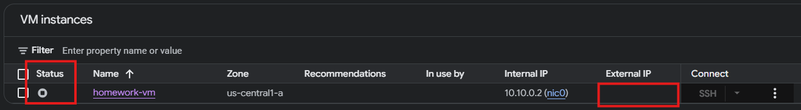
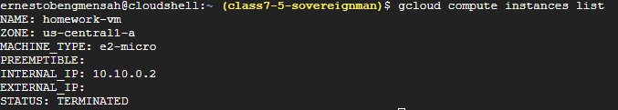
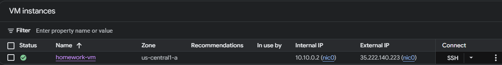
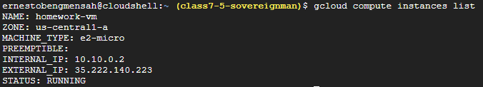
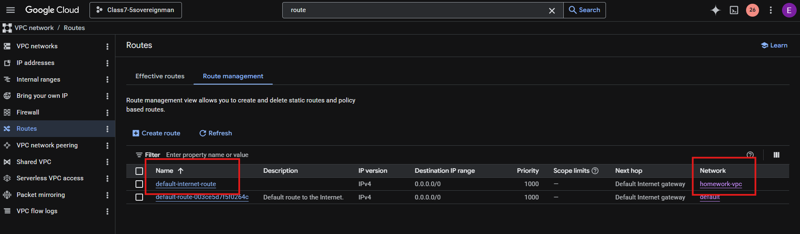
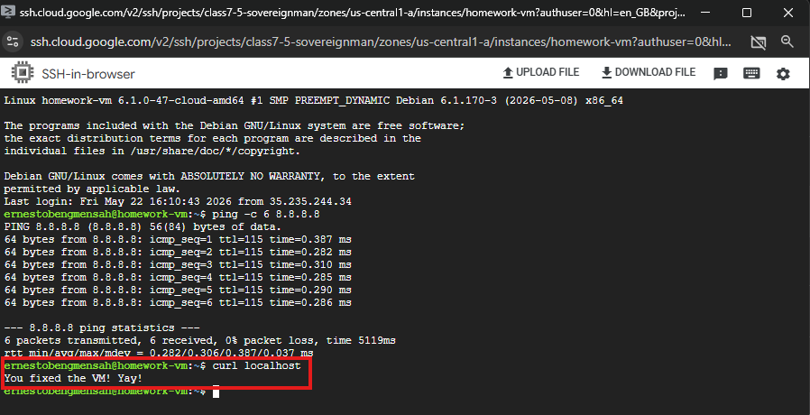
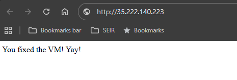

# Runbook: Troubleshooting a Broken VM

## Prerequisites

- Access to the GCP Console (`console.cloud.google.com`)
- The broken environment deployed via:
  ```bash
  curl -s https://storage.googleapis.com/static-site-bucket-522479235074/broken-env-with-prechecks-v2.sh | bash
  ```
---

## Step 1: Verify the VM Exists and Is Powered On

### ClickOps
1. Go to **Compute Engine → VM Instances**.
2. Locate `homework-vm`.
3. Check the **Status** column. If it says **Stopped**, click the three dots (⋮) next to the VM → **Start**.
 

### Cloud Shell
```bash
gcloud compute instances list
```


---

## Step 2: Check for a Public (External) IP Address

### ClickOps
1. In **VM Instances**, click on the VM name.
2. Look under **External IP** in the **Network interfaces** section.
3. If it says **None**:
   - Go to **VPC network → IP Addresses → External IP addresses**.
   - Click **Reserve external**.
   - Name it (e.g., `homework-ip`), Region: `us-central1`, Type: Regional.
   - Click **Attach to** and select `homework-vm`
   - Click **Reserve**
4. You should now have an External IP as shown below.


### Cloud Shell  


---
## Step 3: Examine Firewall Rules

1. Go to **VPC network → Firewall**.
2. Look for rules named `homework-allow-ssh`, `homework-allow-http`, `homework-deny-all`.
3. **Delete** `homework-deny-all` (it has priority 0 and blocks everything).
4. **Edit** `homework-allow-ssh`:
   - Click the rule name → **Edit**.
   - Under **Source IP ranges**, change `1.2.3.4/32` to `0.0.0.0/0` → **Save**.
5. **Edit** `homework-allow-http`:
   - Ensure **Source IP ranges** is `0.0.0.0/0` and **Protocols and ports** include `tcp:80`.

---

## Step 4: Verify Network Tags on the VM

1. Go to **Compute Engine → VM Instances**.
2. Click the VM name.
3. Scroll down to **Network tags**.
4. If `http-server` is missing:
   - Click **Edit** at the top.
   - Under **Network tags**, add `http-server`
   - Optionally, check the **Allow HTTP traffic** box (this auto‑adds the tag).
   - Click **Save**.

---
## Step 5: Verify Internet Connectivity from the VM (Default Route)

1. From **VM Instances**, click **SSH** next to the VM.
2. In the SSH terminal, try to ping an external IP:
   ```bash
   ping -c 3 8.8.8.8
   ```
3. If ping fails (100% loss), there is no default route.
4. Go to **VPC network → Routes**.
5. Make sure the **Primary IPv4 range** is `0.0.0.0/0`.
6. Look for a route attached to `homework-vpc` with destination `0.0.0.0/0` and next hop `default-internet-gateway`. If missing:
   - Click **Create Route**.
   - Name: `default-internet-route`
   - Network: `homework-vpc`
   - Destination range: `0.0.0.0/0`
   - Next hop: **Default internet gateway**
   - Click **Create**.
   
7. Try Step 1 & 2 again. It should be working now.

---

## Step 6: Test the Web Server Locally

From the SSH session, run:

```bash
curl localhost
```
It should show that the VM is fixed.


---

## Step 8: Test the External IP from Your Browser

- Copy the external IP from the VM details page. Or click on the external IP number.  


---

## Verification Summary

After all steps, confirm:

- [ ] SSH works (`gcloud compute ssh` or browser SSH)
- [ ] Ping 8.8.8.8 from the VM succeeds
- [ ] External IP responds with a web page

---