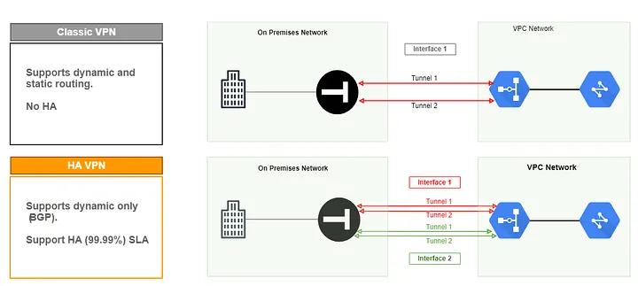

# Difference between Classic VPN and High-Availability (HA) VPN

- Classic VPN is a single tunnel over a single internet connection. If that connection or the VPN gateway fails, your network goes down. This is suitable for scenarios that don’t require high levels of availability.

- HA VPN is a pair of tunnels over two separate connections. If one fails, the other instantly takes over.

  
https://medium.com/@sadoksmine8/hybrid-connectivity-introduction-to-vpn-in-gcp-cd5f16833202

## Analogy
### Classic VPN = A Single Bridge
You must cross a river to get to work. There is only one bridge.  
- Normal day: You drive across. All good.  
- Bridge maintenance (failure): You are stuck. No work. You wait hours for a ferry (manual recovery).  
- Traffic jam (congestion): You are stuck in the single lane.

### HA VPN = A Pilot with Two Engines
Imagine you are flying a twin-engine plane.  
- Normal day: Both engines run. You don't need both, but it's reassuring.  
- Engine #1 fails: You don't crash. The plane seamlessly flies on engine #2. You don't even notice.  
- Engine #2 fails: You have a problem, but statistically, both failing at once is rare.  

Result: HA VPN provides automated failover and redundancy. Classic VPN provides no redundancy.

## The Critical Technical Detail: Routing Protocol
Classic VPN often uses static routes. If the tunnel goes down, the route still exists — traffic is blackholed until you manually remove the route.

HA VPN requires BGP (Border Gateway Protocol). The two tunnels establish BGP sessions. When a tunnel drops, BGP withdraws the route automatically, and traffic shifts to the remaining tunnel within seconds.

## When to Use Which?
### Use Classic VPN if:
- You are prototyping or testing.  
- Your on-prem router doesn't support BGP or multiple tunnels.
- You have another form of redundancy (e.g., separate WAN link with manual switching).
- Cost is a major concern (Classic VPN is cheaper; HA VPN costs ~2x for the gateway).

### Use HA VPN if:
- You are running production applications (databases, APIs, user traffic).
- You require 99.99% availability.
- You have a critical hybrid cloud (on-prem + cloud).
- Your business loses money per minute of downtime.

