# GCP Terraform Lab Exercise 1: Authentication, Backend  and VPC Setup

This document outlines the steps to authenticate Terraform with Google Cloud Platform (GCP) and set up a backend for storing Terraform state files.

## Prerequisites

There are two main steps to complete the authentication and backend setup:

I. Obtain your GCP Project Identification from the following command:

gcloud config get-value project 

Example Output: class75-awesome-project

Update the project_id variable in the 0-authentication.tf file with your project ID.

II. Create a GCS bucket to store the Terraform state file. The bucket name must be globally unique. You can create a bucket using the following command:

```bash
gcloud storage buckets create gs://[BUCKET_NAME]/ --project=[PROJECT_ID]
```

Example:  gcloud storage buckets create gs://awesome-majestic-terraform-state --project=<project_ID>

After running the above command, you should see a message confirming the creation of the bucket, similar to:

Example Output:  Creating bucket [gs://awesome-majestic-terraform-state/]...done.

Verify the bucket creation by listing your buckets:
gcloud storage buckets list --project=[PROJECT_ID]

Example output:
```code
NAME                                 LOCATION          STORAGE_CLASS
awesome-majestic-terraform-state          US              STANDARD   
```     

[NOTE] If you encounter an error stating that the bucket name is already in use, choose a different unique name for your bucket and try again.

You can also create the bucket through the GCP Console by navigating to the Storage section and following the prompts to create a new bucket.

[NOTE] Document the bucket name and project ID for future reference, as you will need them for the Terraform backend configuration.

```bash
gcloud storage buckets create gs://awesome-majestic-terraform-state --project=class75-st-tucker
```
## Authentication and Backend Setup Steps

0 Authentication via gitbash (Windows) or Terminal (Mac/Linux)

Use Application Default Credentials (ADC):

Terraform Authentication Command: gcloud auth application-default login

Example Output:
Your browser has been opened to visit:
```code
https://accounts.google.com/o/oauth2/auth?code_challenge=...&code_challenge_method=S256&response_type=code&client_id=...&redirect_uri=urn%3Aietf%3Awg%3Aoauth%3A2.0%2Fauth%2Fcallback&scope=https%3A%2F%2Fwww.googleapis.com%2Fauth%2Fcloud-platform
```

Example Output: You are now logged in as: [YOUR_EMAIL_ADDRESS]

In the web browser, select the Google account you want to use for Terraform authentication and grant the necessary permissions. After successful authentication, you should see a confirmation message in the terminal.

The final output will confirm that you are logged in and ready to use Terraform with GCP.

[NOTE] If you encounter any issues during authentication, ensure that you have the necessary permissions and that your Google Cloud SDK is properly configured.

At this point you have successfully authenticated with GCP and can proceed to complete the next steps to set up the Terraform backend and deploy infrastructure.

Access the terraform directory and edit the 0-authentication.tf file to ensure that the project variable is correctly set to your GCP project ID.

Set the desired GCP zone in the 0-authentication.tf file to specify where your resources will be deployed. For example, you can set it to "us-central1-a" or any other available zone in your region.


1 Run 0-authentication.tf

```bash
terraform init
```
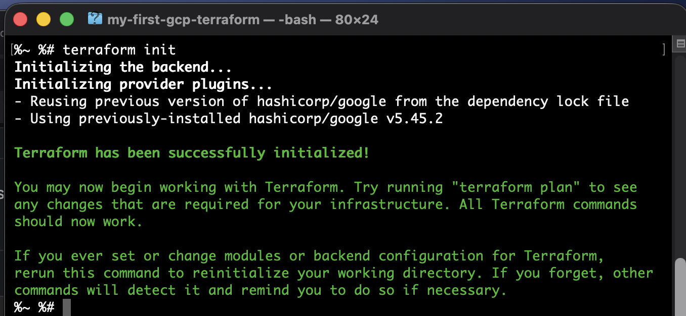

```bash
terraform validate
```

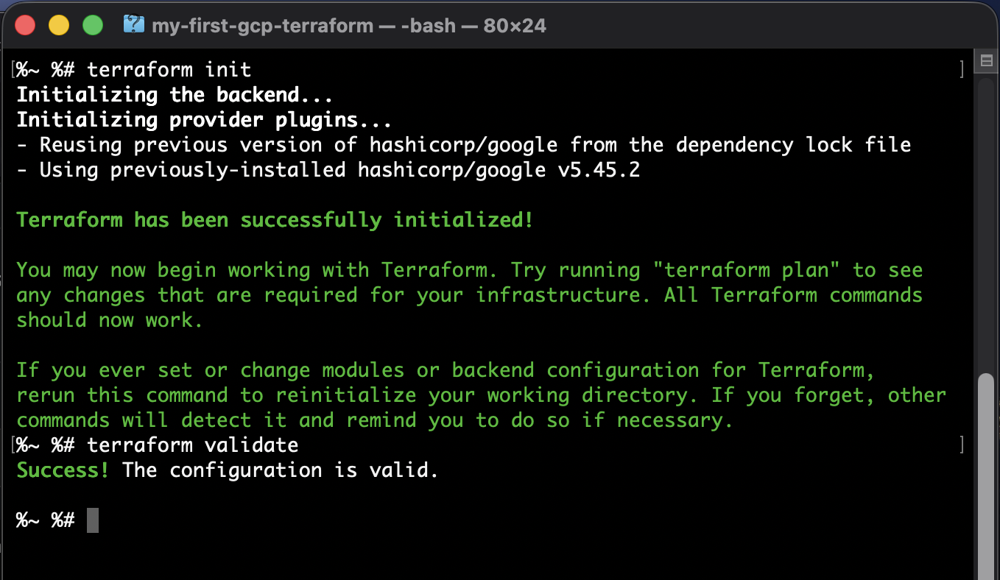

```bash
terraform plan
```

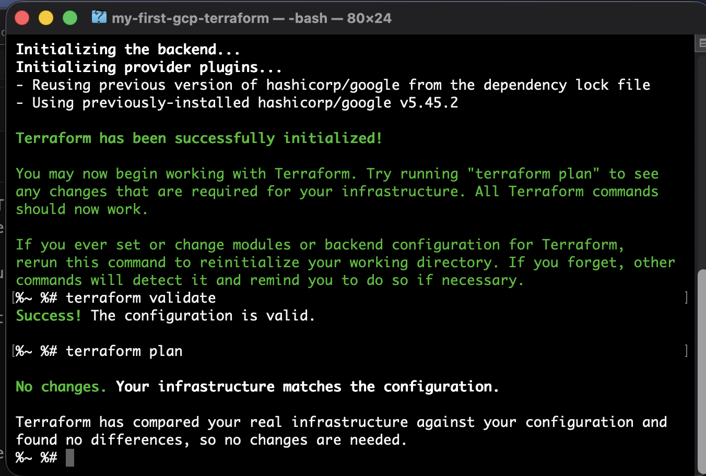

```bash
terraform apply
```

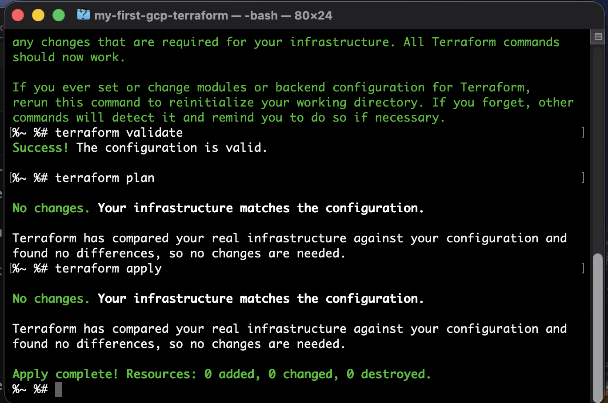


2 Bucket---> Make a bucket

The GCS backend bucket must be created first, before terraform init,
because Terraform cannot use a backend that does not already exist.

[NOTE] The bucket was already created in the prerequisites section, so you can skip this step if you have already created the bucket.

For terraform to use the GCS bucket as a backend, you need to configure the backend in your Terraform configuration files. This typically involves adding a backend block to your Terraform configuration, specifying the bucket name and other necessary details.

In this project we will use the file named 1-backend.tf to configure the GCS backend. Make sure to update the bucket name and project ID in the backend configuration to match the bucket you created in the prerequisites step.


3 Run 

At this stage the terraform authentication and backend configuration should be complete. You can now run the following commands to initialize Terraform, validate the configuration, and apply the changes. Your terraform configuration files should include the files listed below:

0-authentication.tf
1-backend.tf

Run the following commands in the terminal:

```bash
terraform init -upgrade
```


```bash
terraform validate
```

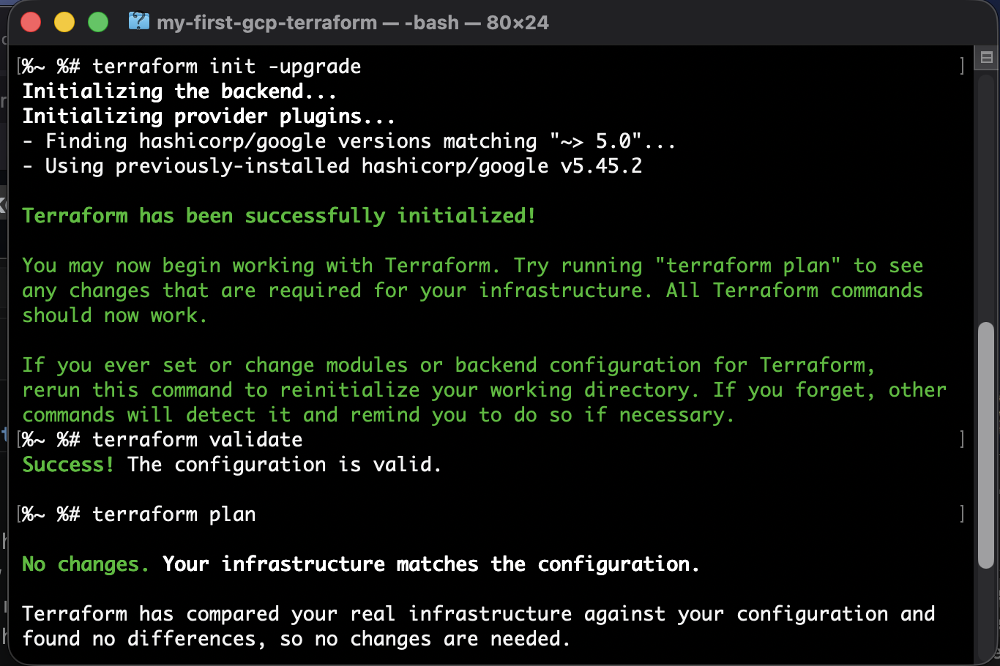

```bash
terraform plan
```

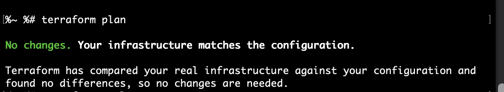

```bash
terraform apply
```

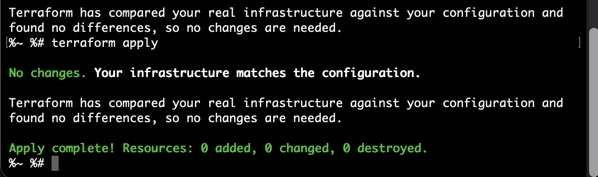

4. Run

At this stage we have successfully authenticated with GCP, configured the backend, and deployed the initial infrastructure. 

You can now proceed to run the next set of Terraform configuration files to further build out your infrastructure. The next file to run is 2-vpc.tf, which will create a Virtual Private Cloud (VPC) network in GCP.

To make deployments easier you can use variables for the file names (e.g. var.project_id, var.bucket_name) and then run the terraform commands with the -var option to specify the variable values. This allows you to reuse the same configuration files across different environments or projects by simply changing the variable values.

An even better approach is to use a terraform.tfvars file to store your variable values, which Terraform will automatically load when you run the terraform commands. This way you can keep your variable values organized and easily manage them without having to specify them on the command line each time.

I have included a terraform.tfvars.example file in the project directory where you can specify your variable values for project_id, bucket_name, and any other variables used in your Terraform configuration files. You will need to copy the terraform.tfvars.example file to terraform.tfvars. 

Be sure to update the values in the terraform.tfvars file to match your GCP project and bucket details before running the next set of Terraform commands.


0-authentication.tf
1-backend.tf
2-vpc

```bash
terraform init 
```
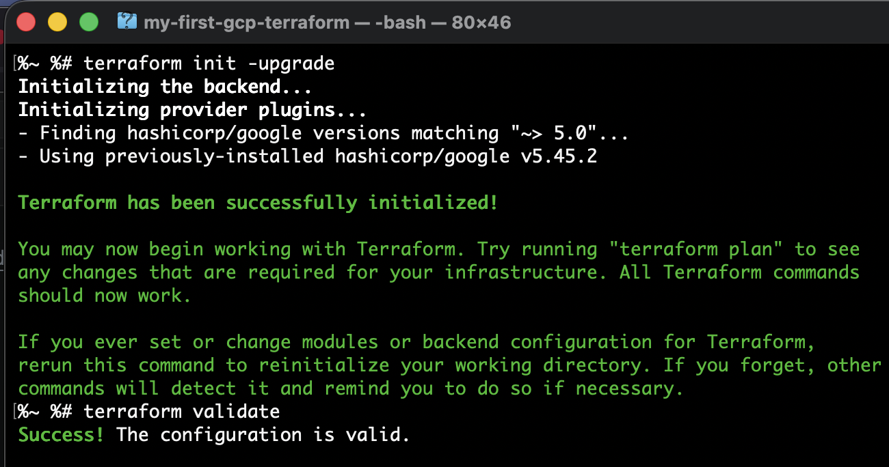

```bash
terraform validate
```


```bash
terraform plan
```
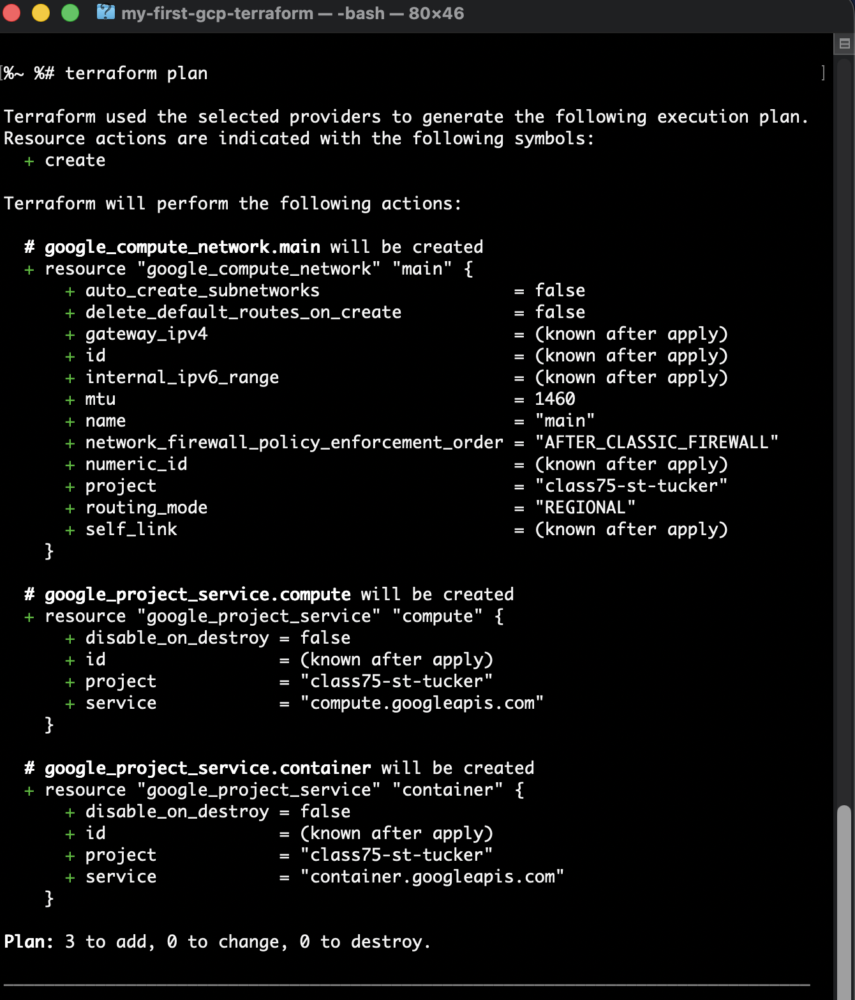

```bash
terraform apply
```

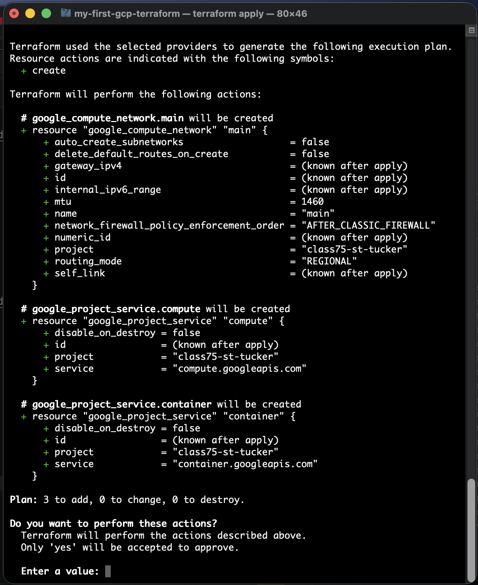


You should see the output confirming that the VPC network has been created successfully. You can verify the creation of the VPC network in the GCP Console under the VPC Network section.

Here is an example of what your GCP bucket can potentially look like in the GCP console web page after running the terraform apply command:

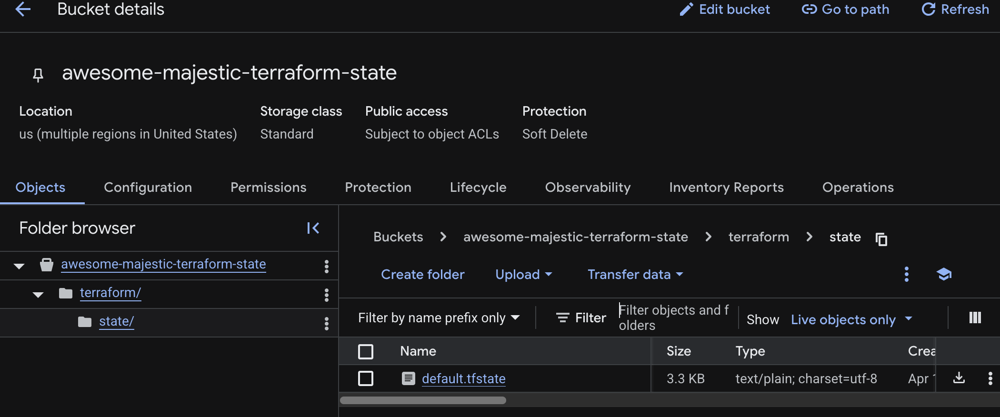


## Teardown of Infrastructure
To tear down the infrastructure that you have created with Terraform, you can use the terraform destroy command. This command will destroy all the resources that were created by your Terraform configuration files.

Before running the terraform destroy command, make sure to review the plan output to ensure that you are aware of all the resources that will be destroyed. You can run the following commands to destroy your infrastructure:

```bash
terraform plan -destroy
```

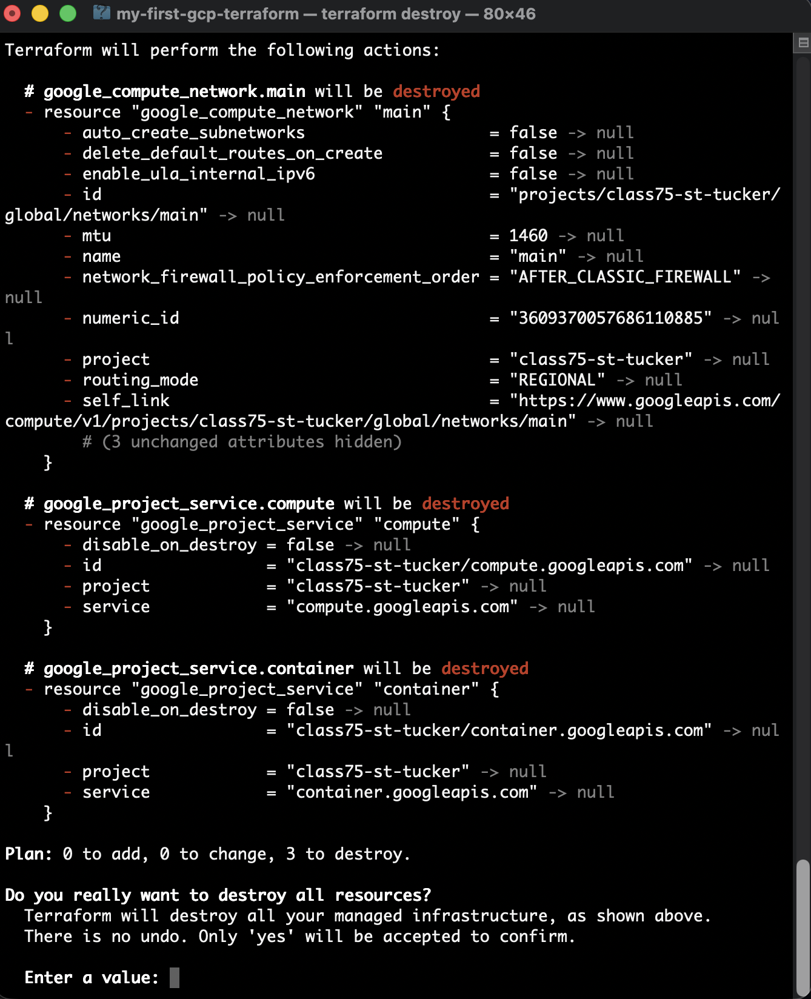

```bash
terraform destroy
```

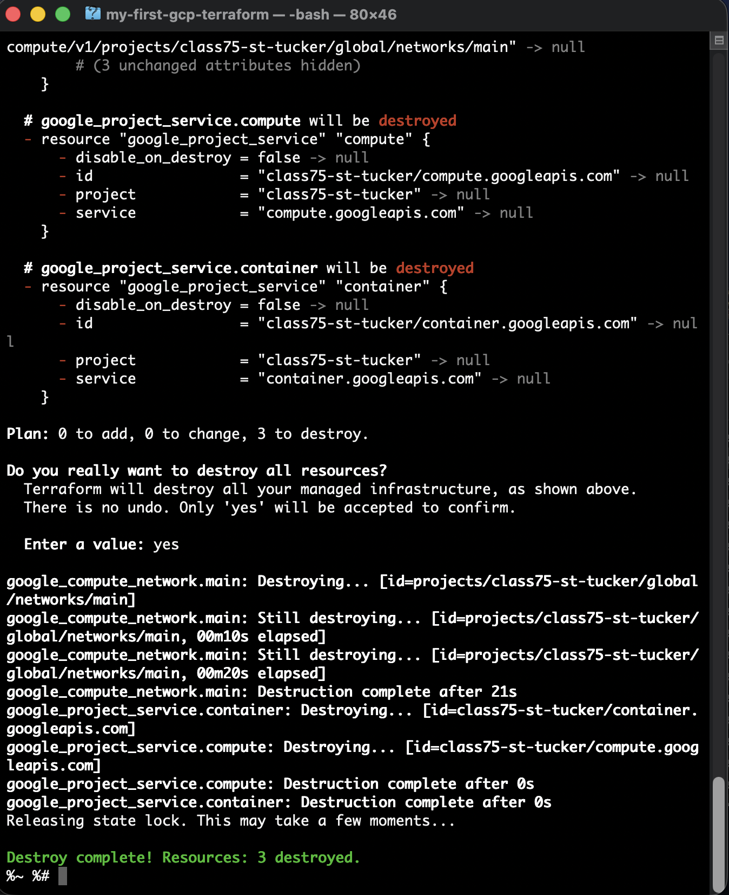

This concludes the steps required to start developing a terraform code for GCP. You can continue to create additional terraform configuration files to build out your infrastructure further, such as creating subnets, firewall rules, and compute instances within the VPC network.

References:
- Terraform GCP Provider Documentation: https://registry.terraform.io/providers/hashicorp/google/latest/docs
- Terraform Backend Configuration: https://www.terraform.io/language/settings/backends/configuration
- GCP Storage Buckets: https://cloud.google.com/storage/docs/creating-buckets  


