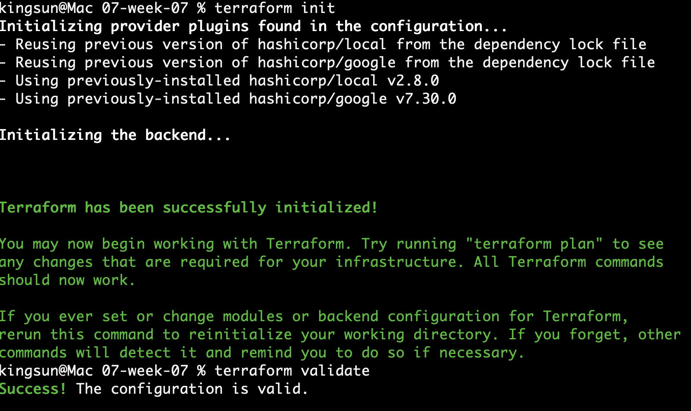
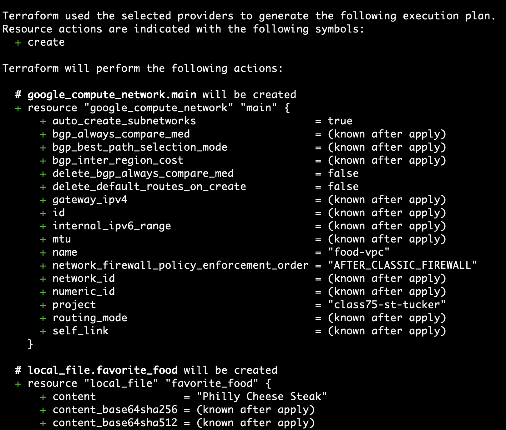
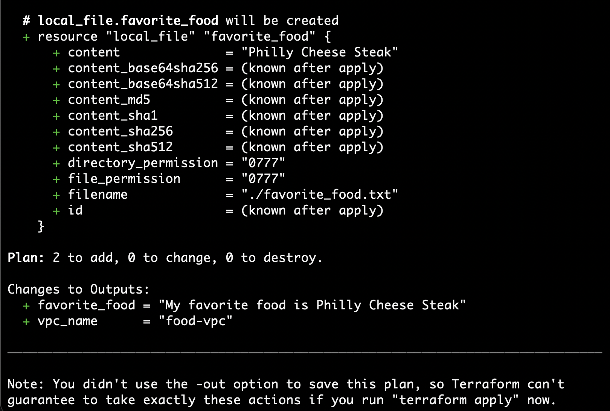
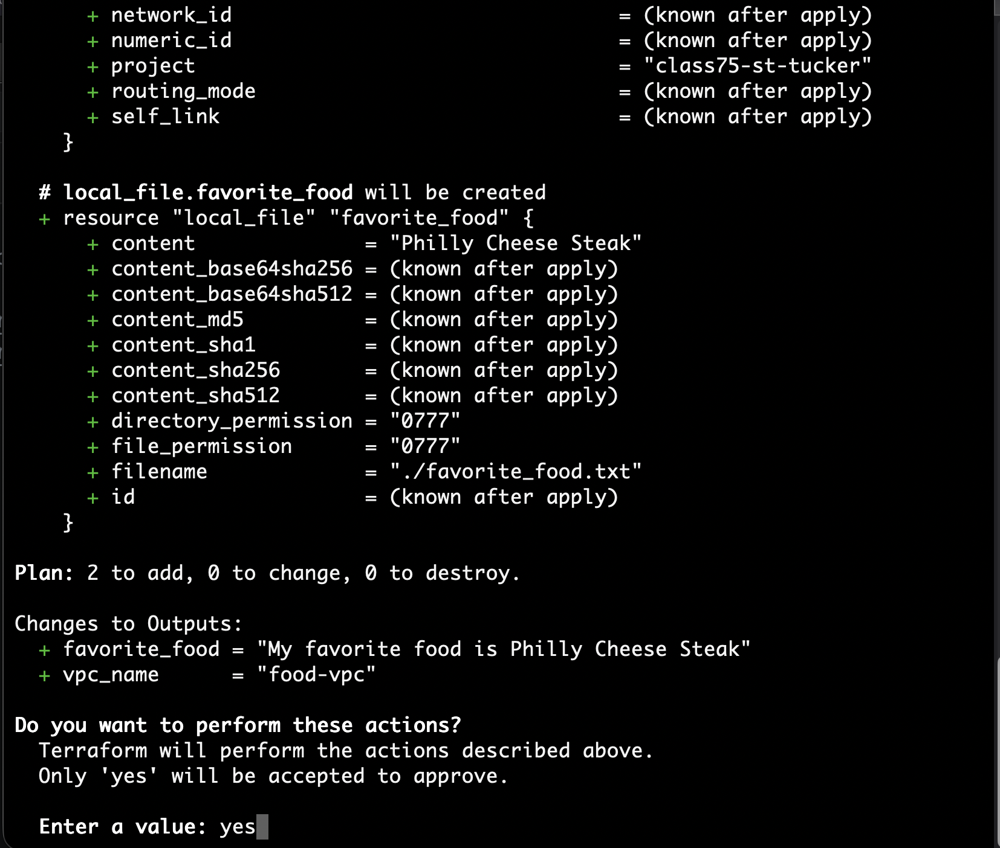
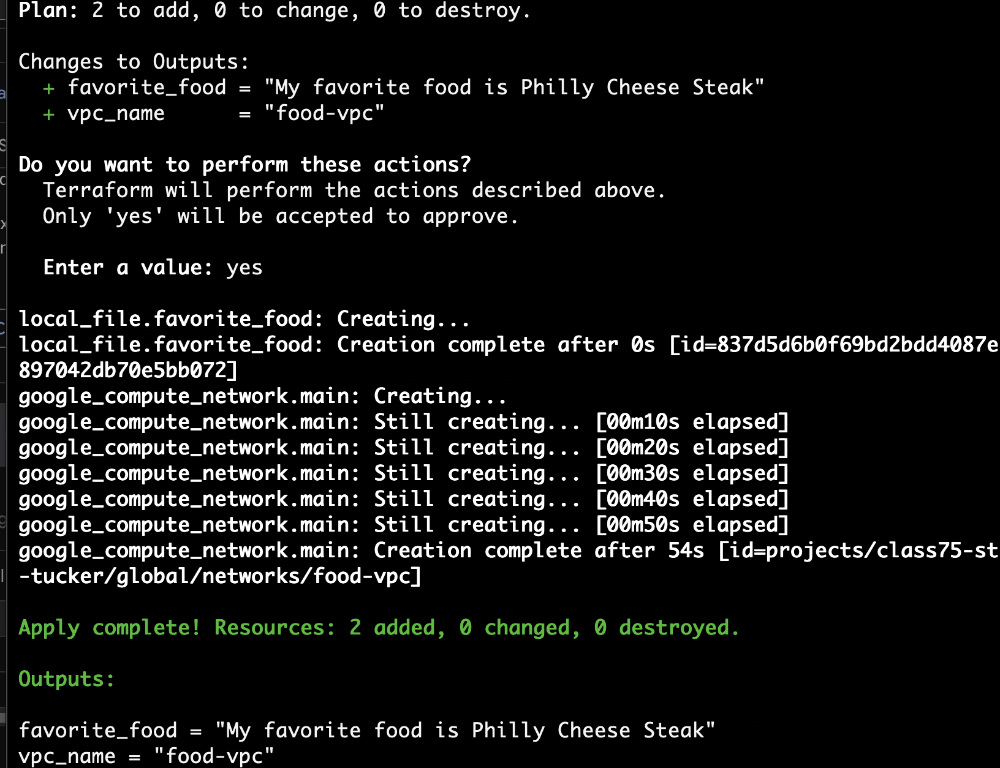
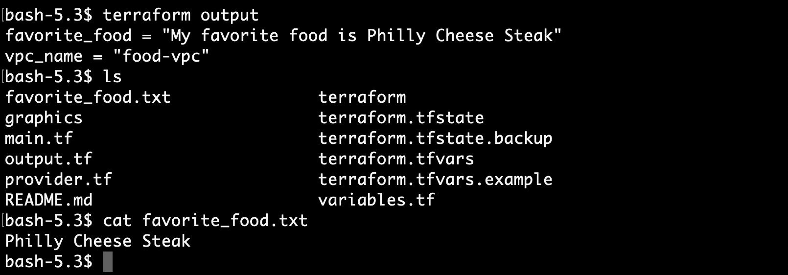
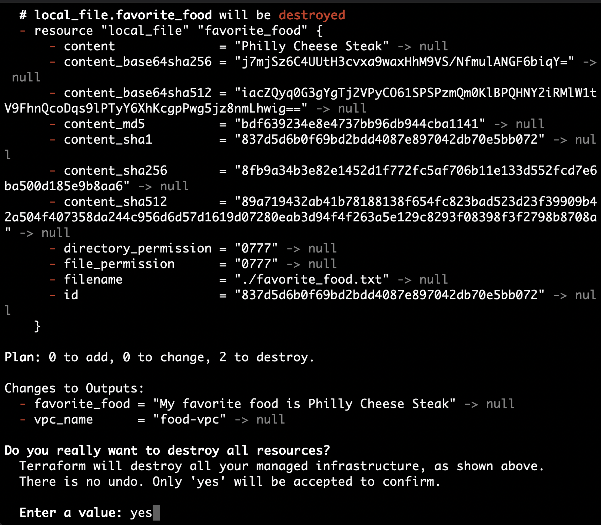
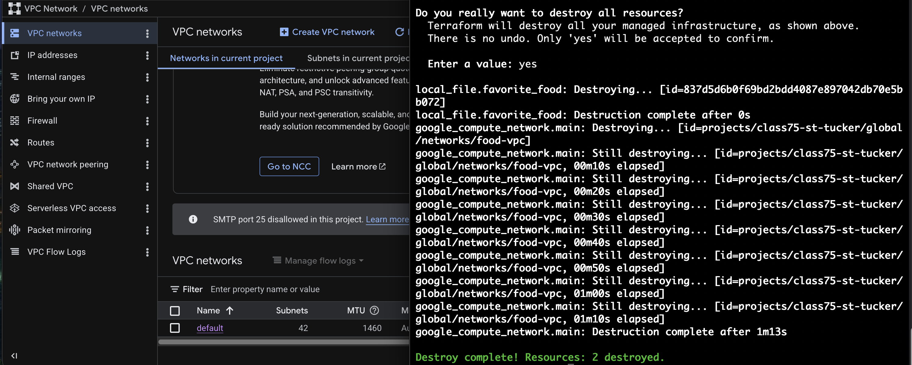

## Purpose

This repository demonstrates deployment of a Virtual Private Cloud (VPC) on the Google Cloud Platform (GCP). It uses terraform code to automate deployment of a VPC and utilizes variables to simplify adjustments to the deployed architecture. This document provides the steps to authenticate with GCP, provides the required terraform configuration files and provides the workflow to utilize terraform to deploy the repository and created file.

[NOTE] This is repository is for academic purposes only.

## Prerequisites
This project requires the following resources to utilize this repository.

- An active Google Cloud Platform (GCP) account

- Google Cloud CLI installed and verified

- Terraform installed and working


## Workflow Overview
1. Authenticate with GCP cloud [NOTE] This workflow does not use environmental variables (e.g. .env, var), service accounts or the cloud shell for authentication.
2. Create and/or modify terraform code (as needed). 
3. Deploy infrastructure.
4. Generate deliverables.
5. Perform teardown of infrastructure and verify all resources have been removed from your GCP project.

 
[NOTE] In this repository resources that are created will not be retained. However the project used  to support this assignment will be automatically removed by running terraform destroy. You should still verify that all resources that are listed in the terraform code were actually removed to keep your expenses to a minimum.


## Tree structure of the repository
```
├── graphics
│   ├── gcp-console-with-food-vpc.png
│   ├── terraform-apply-yes.png
│   ├── terraform-destroy-complete-vpc-deleted.png
│   ├── terraform-destroy.png
│   ├── terraform-init-validate-screenshot.png
│   ├── terraform-output-textfile-evidence.png
│   ├── terraform-output.png
│   ├── terraform-plan-1-of-2.png
│   └── terraform-plan-2-of-2.png
├── README.md
└── terraform
    ├── main.tf
    ├── outputs.tf
    ├── provider.tf 
    ├── terraform.tfvars.example
    └── variables.tf
```

## Deployment Instructions
1. Clone this repository to a local system where you have the prerequisite software.
2. Enter the downloaded repository folder and open the README.md file.
3. Authenticate with GCP cloud following standard procedure. Reference: https://docs.cloud.google.com/docs/authentication
Change to directory named /terraform and review existing terraform file ending in .tf to get familiar with the code and what terraform will do under your GCP account.
4. Copy the terraform.tfvars.example file to terraform.tfvars. 

```
cp terraform.tfvars.example terraform.tfvars
```

5. Edit the terraform.tfvars file to meet your requirements. For example provide your favorite food as the default is "Philly Cheese Steak"
[NOTE] Please be sure to save any files you edit before proceeding.

6. Run the terraform commands below
```Code
terraform init
terraform fmt        # Only if you made changes
terraform validate
terraform plan       # Review output carefully
terraform apply      # Type YES when prompted
[NOTE] This is the stage where you capture screenshots for deliverables.
```

## Deliverables
1. Terraform code that creates a VPC and a subnetwork in the same region.

2. A text file that contains the output of terraform output command.

3. A screenshot of the terraform plan output.

4. A screenshot of the terraform apply output showing VPC name.

5. A screenshot of the terraform destroy output.

6. A screenshot of the GCP console showing that the VPC and subnetwork have been removed.
 
7. Gitignore file that excludes terraform state files and any other files that should not be committed to the repository.
  
8. File created by terraform including the content of the text file (e.g. cat favorite-food.txt) that contains the value of the local variable that is used in the terraform code.

9. A README file that includes the following sections:
   a. Explanation of how you completed the assignment, 
   b. Documentation used.
   c. Resources used.
   d. Issues encountered and how you resolved them.
   e. References.  

## Post Deployment Tasks
Once you have captured the required deliverables you should teardown your terraform deployment. To teardown your terraform deployment run the following commands from within the same /terraform folder you ran your `terraform apply` commands.

```code
terraform destroy 
```

[CAUTION] Review the output carefully to make sure what you intend to happen is *ONLY* what terraform is stating it will do. Once you are okay with the results of the `terraform destroy` output shows, then proceed to the teardown the deployed resources.

```code
terraform destroy
```

At this point you will need to enter yes to confirm to terraform that you are *OK* with terraform performing destruction of the deployed resources.

Once terraform shows a status of destruction complete, review the GCP console to confirm all deployed resources that you intend to be removed from service has occurred.


## Issues Encountered and Resolutions
Issue 01: Non-readable output on terraform created file "favorite_food.txt" when using a terminal text reader. 
During initial test runs of the terraform code, the output of information was not properly formatted. Specifically the output of cat was not able to be properly viewed in the terminal. This was caused by the "space" at the end of the text output. 

Troubleshooting Effort(s): Through research I found that terraform was generating the content correctly, however the file needed a `newline` to allow when a user opens the file using a terminal tool like `cat`. 

For example they run `cat favorite_food.txt` the output in the terminal would be ChickenUser$. The desired output should not show the shell prompt at all.

Corrective Action(s): I added the "newline" character `\n` to the content for the local_file resource. This resolved the issue when using a command line tool to output the content of the terraform produced file/

I provided details of this in the actual terraform code in main.tf. 

```terraform
resource "local_file" "favorite_food" {
  # Newline character is added to the end of the content to ensure that the file ends
  #  with a newline, which is a common convention for text files. 
  # So when you open the file with a command like `cat`, the output will
  #  be displayed correctly without any formatting issues.
  content  = "${var.favorite_food}\n"
  filename = "${path.module}/favorite_food.txt"
}
```

Issue O2: Terraform Code Revision in local_file resource causes malformed output on Terraform Console Output
This issue was induced by >me< adding code that had terraform generate output of value "favorite_food". 

This terraform output was not identified as a deliverable and was added by me to ensure I had "proof" that the value was actually being generated by terraform.

Troubleshooting Efforts(s): I initially removed the change I made in main.tf which eliminated the problem. However I wanted to determine what would be an acceptable correction as from experience I have had to generate outputs like this one on other projects leveraging terraform.


Corrective Action(s): I eventually was able to find that terraform has a built-in function called `trimspace`. The trimspace function removes any space characters from the start and end of a given string.

I provided details of this in the actual terraform code in outputs.tf.

output "favorite_food" {
  description = "Output showing my favorite food"
  # Used trimspace to remove any leading or trailing whitespace from the content of the file.
  # Otherwise the output end up looking like with extra spaces and EOT fields.
  value = "My favorite food is ${trimspace(local_file.favorite_food.content)}"
}

Issue 03: Terraform destroy command removes local_file favorite_food.txt
This issue is considered an "as expected outcome". So it is not really an issue and is more of a "gotcha" when it comes to terraform being literal when told to *destroy* resources. Since the terraform code says for terraform to manage the creation of the file favorite_food.txt, then when told to destroy the deployed resources it will by default destroy the file favorite_food.txt.

Troubleshooting Efforts(s): For this issue I did find that I could manually copy the file outside of the /terraform folder and  that way I would have the file. I did not add that to this workflow because what I would prefer that I automate that process. So for now when `terraform destroy` is run the file favorite_food.txt will be destroyed along with any other terraform managed resources.

Corrective Action(s): I am researching a method to have terraform run a shell command that copies the file favorite_food.txt
 outside of the favorite_food.txt *OR* change the path where local_file creates the file. Currently it set to ${path.module} which tells terraform the directory of the current module. In this repository that is the /terraform directory.

Reference: https://developer.hashicorp.com/terraform/language/functions/file

## Documentation Utilized
Various documents were used to write the terraform code, run the code, troubleshoot any issues, and generate deliverables. The documents for each configuration used in terraform are in the "References" section of this document. Terraform code was typically copied as-is and modified when required. Variables were used to simplify the deployment workflow and make it easier to troubleshoot especially for individuals who may not be familiar with GCP resource deployments leveraging terraform.

## Deployment Deliverables (Screenshots & Outputs)

This section contains all required screenshots captured during the Terraform deployment workflow. Each screenshot is labeled with the corresponding step in the workflow for clarity.

1. Terraform Init & Validate

```bash

terraform init

terraform validate
```

 

2. Terraform Plan

```bash

terraform plan
```

 


 

3. Terraform Apply

```bash

terraform apply
```


 


 

4. Terraform Output

```bash

terraform output
```


 

5. Terraform Destroy

```bash
terraform destroy
```

 


6. GCP Console Verification of Terraform Resource Destruction

 


## References
Provider configuration https://registry.terraform.io/providers/hashicorp/google/latest/docs

Google VPC https://registry.terraform.io/providers/hashicorp/google/latest/docs/resources/compute_network
https://docs.cloud.google.com/infrastructure-manager/docs/deploy-vpc-with-terraform
https://developer.hashicorp.com/terraform/tutorials/gcp-get-started/google-cloud-platform-build

Google Compute Subnetwork https://registry.terraform.io/providers/hashicorp/google/latest/docs/resources/compute_subnetwork

terraform local_file https://registry.terraform.io/providers/hashicorp/local/latest/docs/resources/file

Terraform outputs https://developer.hashicorp.com/terraform/language/values/outputs

Terraform gitignore https://github.com/github/gitignore/blob/main/Terraform.gitignore 
https://www.toptal.com/developers/gitignore 

Trimspace function https://developer.hashicorp.com/terraform/language/functions/trimspace