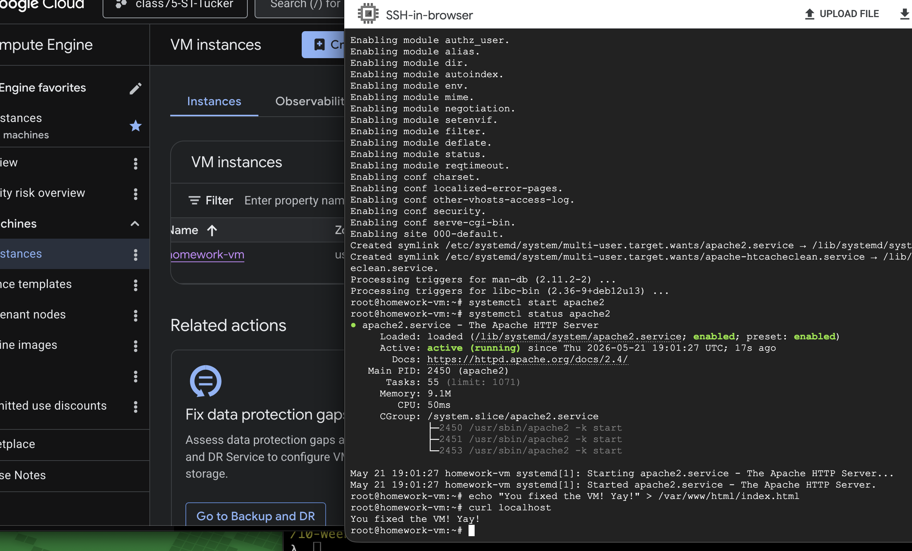

## GCP Infrastructure: DNS, SSL/TLS, and Service Troubleshooting

This assignment continues focus on foundational GCP infrastructure concepts, including Domain Name Service (DNS), SSL/TLS, and service troubleshooting. It includes a runbook documenting my investigative and troubleshooting actions for an unidentified service outage. The runbook leverages a academic intentionally "broken" sandbox environment. The Terraform deployment includes a VPC, firewall rules, VM instance template, Managed Instance Group (MIG), and an HTTP Global Application Load Balancer.


### Questions & Answers
#### DNS and SSL/TLS
Explain what the traceroute and dig commands do. Compare and contrast.
Traceroute and dig are commonly used network tools. They are typically used to support troubleshooting of network related issues, but can also be used for network infrastructure validation.

#### Traceroute
The traceroute application is used to identify the path network traffic takes from one network enabled system (e.g. local desktop) to another network-enabled device (e.g. server ) on public or private networks.

It accomplishes this by sending packets with gradually increasing time-to-live (TTL) values. Each layer 3 (router) device along the path that is reached will cause a decrease of the TTL value. When connectivity is functional the TTL value will reach zero. At that point the information provided by traceroute will provide a list of every router between the source and destination system.

Example Usage:

- Troubleshooting slow or intermittent loss of connection between a on-premise server in New York and a Cloud Service Provider VPC in California.

- Identifying where network traffic may be getting dropped or blocked.

- Identifying the path network traffic takes to reach a destination.

#### Dig
The dig application is typically used for DNS troubleshooting and lookup of DNS records.
Dig with the appropriate "options" can produce brief or detailed DNS information about a provided domain or fully qualified domain name.

```bash
dig [server] [name] [type]
```
Example Usage:

- Lookup IP address(s) for a domain name (e.g. dig +short www.example.com) # This provides a "brief" answer.

- Query A record (e.g. dig example.com A)

Perform reverse DNS lookup (e.g. dig -x 1.1.1.1) This tells dig to perform a reverse lookup to find the domain name associated with the IP address of 1.1.1.1.

#### Compare & Contrast

traceroute
Primary purpose: show network path

dig
Primary purpose: query DNS records

traceroute
What function does it provide: Connectivity troubleshooting/validation 

dig
What function does it provide: DNS troubleshooting

traceroute
Output(s): Router ID, number of hops
dig
Output(s): DNS records and response

traceroute
Common problems where it is used: packet loss, latency Name Server record configuration

dig
Common problems where it is used: DNS resolution, DNS record configuration, reverse DNS lookup

To put it plainly, a system administrator or network professional would use traceroute to help identify "How does my data get from here to there?". They would use dig to help answer "Can this name be resolved?"

What are the 3 or 4 most common DNS records and what are their use cases?
The most common to expect to see are the A record, CNAM record and MX record in a typical enterprise environment. If using IPv6 then you may see AAAA records.

- A record is used to map a domain name to an IPv4 address.

Use Case: Identifies the server hosting your domain/subdomain network service (e.g. webstore.exampl.com)

- AAAA record is used to map a domain name to an IPv6 address.

Use Case: This is the equivalent of the A record for devices that have IPv6 addresses.

- CNAME record is an alias domain to a "target" domain. For example sub-domain www.example.com would map to primary domain example.com.

Use Case: Directs subdomain to primary domain www.example.com.

- MX record is used to identify email servers that will accept email for a given domain. This allows for routing email between email providers.

Use Case: email server sending an email can query the MX record (e.g. mail.example.com) allowing the transmitting email server mail.godaddy.com to route message to the destination email server/account sales@mail.example.com.

Give an overview of the steps in a TLS handshake.
A Transport Layer Security (TLS) handshake involves multiple steps with the objective to establish a secure encrypted connection between a client (e.g. web browser) and a service. The TLS handshake is a negotiation and verification process to establish a secure communication session.

The basic flow is:

- The client initiates a session negotiation by stating the supported version of TLS, encryption (cipher) suites it supports and a random value.

- The server responds with what version of TLS it will use, encryption suite, its SSL certificate and its own random value.

- The client validates the server provided certificate with a trusted Certificate Authority (CA) record. CA records are typically stored locally on the client.

- The client and server make an agreement on what cryptographic suite they will use and shared (symmetric key) to be used for encryption of data exchanges.

- The generated session keys are used to support a secure session.

How does an SSL/TLS cert know what domain it belongs to?
The SSL/TLS certificate is bound by a public key to a domain name which is verified by a CA. The certificate request utopia.com.csr is sent by a domain requester to a CA. The CA performs its own validation workflow and signs the certificate request. The CA provides the signed certificate to the requester. The requester hosts the certificate on their given network service.

When a client system connects to the service and are presented the certificate they reference the certificate chain provided by the CA.

What is a certificate authority?
A certificate authority is considered a trusted agency that issues digital certificates to various entities including individuals, organizations, websites, etc. Their primary role is to validate the identity of the certificate requester and issue certificates to validated requestors. They also manage certificate revocation lists.

#### Load Balancers
How do application load balancers in GCP offload (decrypt) SSL? What part of the load balancer does this?
Application Load Balancers offload SSL/TLS at the Google Front End (GFE) or Envoy proxy layer, which performs the TLS handshake and decryption. The edge proxy is the component that actually performs the TLS handshake and decrypts traffic. The Target HTTPS Proxy does not decrypt traffic; it holds SSL certificates, applies SSL policies, and instructs the GFE how to handle TLS sessions before forwarding the unencrypted request to the backend service.

Reference:
https://docs.cloud.google.com/docs/security/infrastructure/design#google-frontend-service

Are there use cases to have in flight encryption from the backend service to the backend itself?
Some organizations handle data that is required by law to provide end-to-end encryption.

Example Usage:

- Healthcare (HIPAA)

- Financial (PCI-DSS)

#### Cloud Domain/DNS
Can multiple domains end up pointing to the same LB?
Yes, multiple domains can point to the same application load balancer by leveraging DNS records to map each domain to the same IP address of the load balancer. The load balancer can then use host‑based routing to direct traffic to the appropriate backend based on the Host header in the request.

In the context of Cloud DNS, what are zones?
A DNS zone is the database that stores the records for a specific domain or subdomain. It contains records like A/AAA, CNAME, MX, etc.

#### Runbook
The runbook is in a separate file named RUNBOOK.md Screenshot as a deliverable is provided here:



#### Terraform
Terraform code can be found in the `terraform` directory. It includes a VPC, firewall rules, VM instance template, Managed Instance Group (MIG), and an HTTP Global Application Load Balancer. It deploys a basic webpage that is accessible via the load balancer's IP address only. Firewall rules allow HTTP traffic to the load balancer and SSH access to the VM instances in the MIG. A recommended improvement is to move the instances to private subnets and use a bastion host for SSH access or IAP SSH. Current deployment has VM with no `public` IP address and Cloud Router and NAT to allow the VM to access internet for patches and software.

For SSH access this deployment allow access via GCP console SSH and gcloud CLI. For gcloud cli use the following commands

Reference: https://docs.cloud.google.com/compute/docs/connect/ssh-using-iap

1. Identify the names of running instances.
```bash
gcloud compute instances list
```

example output
```
 gcloud compute instances list
NAME           ZONE        MACHINE_TYPE   PREEMPTIBLE  INTERNAL_IP  EXTERNAL_IP  STATUS
mephisto-qf88  us-east1-b  n2-standard-2               10.100.1.2                RUNNING
mephisto-gjb5  us-east1-c  n2-standard-2               10.100.1.3                RUNNING
```

2. Use IAP tunnel to connect to the desired compute instance.

```bash
  gcloud compute ssh mephisto-gjb5 --tunnel-through-iap
```

Example output:
```
No zone specified. Using zone [us-east1-c] for instance: [mephisto-gjb5].
WARNING: 

To increase the performance of the tunnel, consider installing NumPy. For instructions,
please see https://cloud.google.com/iap/docs/using-tcp-forwarding#increasing_the_tcp_upload_bandwidth

Warning: Permanently added 'compute.6527099147504130800' (ED25519) to the list of known hosts.
```