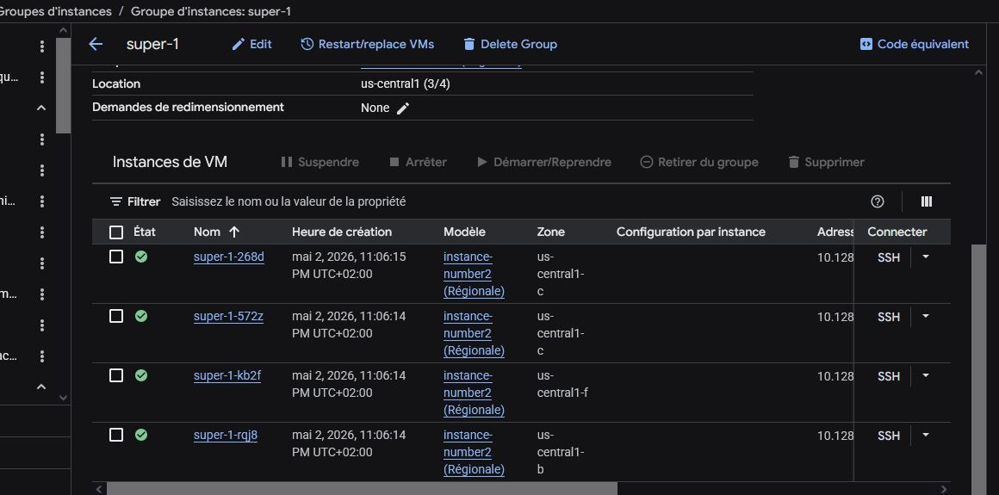

# Creating Managed Instance Group (MIG) with Clickops

The Goal of the following steps is to create a working MIG.
It will make it easier to manage several instances made from a same template. This will provide §High availability to our services if those ressources are deployed across region. The MIG will be configured with autoscaling and autohealing.

## Prerequiste

1. You need to be able to access the GCP console
2. You need to have a VPC (the default is fine)
3. Firewall rules that allow traffic on HTTP (TCP port 80)
4. You need to create a template that will be the basis of images in the Managed Instance Group
5. The template should run a webserver and serve an index.html page
6. The compute engine API must be enabled for your user

## Creating the MIG
1. Log into GCP
2. go to Compute Engine -> Instance Groups
3. Click create instance
4. Fill in a name and description 
5. Select your instance template from the list of instance templates 
6. For the Number of Instances enter at least 3 You want at least 3 in order to have your instances spread over at least 3 zones
7. Under Location, choose Multiple Zones
8. Select a region and check at least 3 zones (if your region has less than 3 then select the max number you can) 
9. Click the Configure Autoscaling button
10. Set the min/max number of zones -- the min number should at least equal the number of zones you selected
11. Under the Autohealing section, Click in the Health check box and then click Create a health check using the values in the screenshot below for reference
12. Leave everything else as default and click the blue Create Button
13. Go to the Managed Instance Group and monitor the status as well as instances It may take 5 or more minutes for your instances to come up and be considered healthy

## Teardown

1. Open your managed group
2. Click Delete Group
3. Go to Health Checks -> Delete the Health Check
4. Go to Templates -> Delete the template (this is optional as you are generally not charged for health checks)