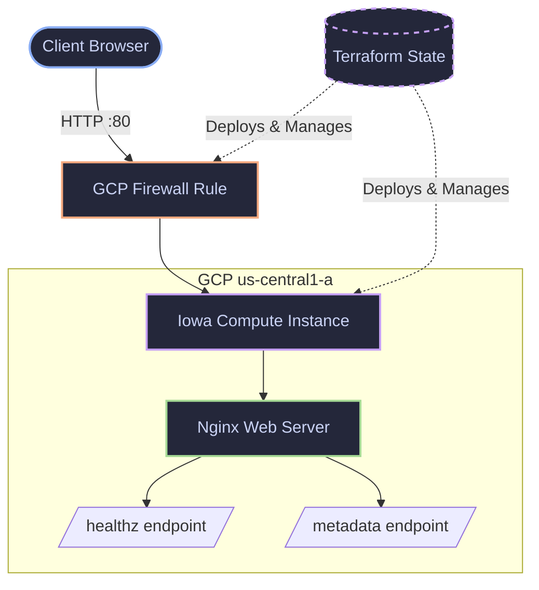

<div align="center">

[](https://cloud.google.com/)
[](https://www.terraform.io/)
[](#)

# SEIR-1 7.5 - GCP Ops & IaC Runbooks

**Group Leader #1:** [M-Bash](https://github.com/M-Bash) | Cohort 7.5<br>
**Group Leader #2:** [Brimah](https://github.com/Brimah-Khalil-Kamara) | Cohort 7.5<br>

*Infrastructure-as-Code (IaC) deployments and grading validations for GCP. Tracks the transition from imperative provisioning to declarative state management.*

</div>

<br>

## 🏛️ Infrastructure Architecture (Wk 2)



---

### Wk 1: Ephemeral Compute & Health Routing
Provisioning a GCP Compute Engine instance serving Nginx, configured with `/healthz` and `/metadata` endpoints for load-balancer validation.

<details>
<summary><b>Execution & Gate Validation</b></summary>
<br>

**1. Provision**
```bash
gcloud init
```

**2. Local Verification**
```bash
curl -s localhost/healthz
curl -s localhost/metadata | jq .
```

**3. Remote Gate Validation**
Executes the SEIR-I grading script against the deployed public IP.
```bash
export VM_IP="<EXTERNAL_IP>"
./scripts/gate_gcp_vm_http_ok.sh
```

**Output:**
```json
{
    "lab": "SEIR-I Lab 1",
    "status": "PASS",
    "details":[
        "PASS: Homepage reachable (HTTP 200)",
        "PASS: /healthz endpoint returned 'ok'",
        "PASS: /metadata returned valid JSON"
    ]
}
```
</details>

---

### Wk 2: GCP + Terraform
Codifying the Wk 1 stack. Deploys an Iowa (`us-central1-a`) Compute instance, ingress firewall rules (tcp/80), and automated startup scripts.

<details>
<summary><b>Execution & Gate Validation</b></summary>
<br>

**1. State Execution**
```bash
terraform init
terraform validate
terraform plan -out=tfplan
terraform apply tfplan
```

**2. Automated Gate Validation**
Extracts the ephemeral IP directly from Terraform state to pass to the grading script.
```bash
export VM_IP=$(terraform output -raw vm_external_ip)
./scripts/gate_lab2_http.sh
```

**3. Teardown**
```bash
terraform destroy -auto-approve
```
</details>

---
*Note: All infrastructure in this repository is designed to be ephemeral. `terraform destroy` is enforced post-validation to maintain zero idle cloud spend.*