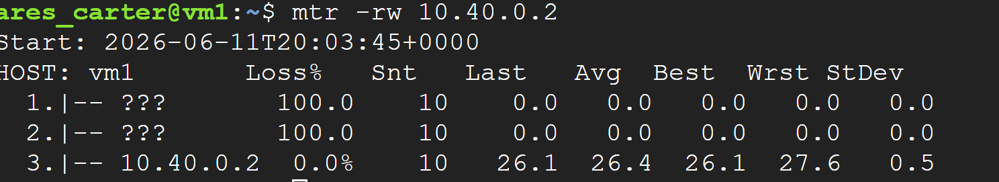

### Parameter Mapping Table

|**Setting**|**Project A (Dallas)**|**Project B (Mexico)**|
|---|---|---|
|**VPC Name**|`my-vpn-network`|`my-vpn-ip-2`|
|**Subnet CIDR**|`10.30.0.0/16`|`10.72.0.0/16`|
|**Gateway Static IP**|`[Paste IP A Here]`|`[Paste IP B Here]`|
|**Peer Gateway IP**|`[Paste IP B Here]`|`[Paste IP A Here]`|
|**Shared Secret**|`89GL1/VbuTS9LvbH7AVFhj60W6SScKNi`|`89GL1/VbuTS9LvbH7AVFhj60W6SScKNi`|
|**Remote Subnet**|`10.72.0.0/16`|`10.30.0.0/16`|
### Runbook: Site-to-Site Classic VPN (Dual-Account)

#### Phase 1: Infrastructure Setup (Repeat for both Project A and Project B)

1. **VPC Network:**
    
    - Navigate to **VPC network** > **Create VPC network**.
        
    - **Name:** `my-vpn-network` (Unique to the project).
        
    - **Subnet:** Custom mode > **Name:** `subnet-1` > **Region:** Select target region > **IPv4 Range:** `10.30.0.0/16` (Ensure this is unique for each VPC to avoid routing conflicts).
        
    - Click **Create**.
        

#### Phase 2: VPN Configuration

1. **VPN Gateway:**
    
    - Search for **Network Connectivity Center** > **VPN** > **Create VPN connection**.
        
    - Select **Classic VPN** > **Continue**.
        
    - **Name:** `vpn-gateway-1`.
        
    - **Network:** `my-vpn-network`.
        
    - **Region:** Matches the VPC subnet region.
        
    - **IP Address:** Create a new **Static** External IP. (Note this IP address—it is the "Peer IP" for the _other_ VPC).
        
2. **VPN Tunnels:**
    
    - **Name:** `vpn-tunnel-1`.
        
    - **Remote Peer IP:** Enter the static IP created for the _other_ VPC’s gateway.
        
    - **IKE Pre-shared Key:** Use a shared string (e.g., `89GL1/VbuTS9LvbH7AVFhj60W6SScKNi`). _Ensure both accounts use the exact same key._
        
3. **Routing Options:**
    
    - **Remote network IP ranges:** Enter the CIDR range of the _other_ VPC's subnet (e.g., `10.224.0.0/16`).
        

#### Phase 3: Firewall Rules (Critical for Traffic)

_You must allow internal traffic and ESP/UDP traffic for the tunnel to function._

1. **Create Rule 1 (Tunnel Traffic):**
    
    - **Name:** `allow-vpn-tunnel`.
        
    - **Direction:** Ingress.
        
    - **Action:** Allow.
        
    - **Source IP ranges:** The Public IP of the _remote_ VPN Gateway.
        
    - **Protocols and ports:** UDP 500, UDP 4500, and ESP.
        
2. **Create Rule 2 (Internal Traffic):**
    
    - **Name:** `allow-internal-traffic`.
        
    - **Direction:** Ingress.
        
    - **Action:** Allow.
        
    - **Source IP ranges:** The remote VPC subnet range (e.g., `10.224.0.0/16`).
        
    - **Protocols and ports:** All protocols.
        

#### Phase 4: Compute Deployment

1. **VM Instance:**
    
    - **Name:** `vm-1` (or `vm-2` for the second account).
        
    - **Region:** Must match your VPC subnet region.
        
    - **Networking:** Under **Advanced configurations**, ensure the network is set to your custom `my-vpn-network`.
        
    - **Check:** "Allow HTTP/HTTPS traffic" (optional, for testing).
        
    - **Click Create.**
        

### Verification Steps

Run these commands from the terminal:

1. **Connectivity Check:**
    
    Bash
    
    ```
    ping <Internal-IP-of-Remote-VM>
    ```
    
2. **Path Verification:**
    
    Bash
    
    ```
    sudo apt install mtr -y
    mtr -rw <Internal-IP-of-Remote-VM>
    ```
    

### Phase 5: Tear Down (Cleanup)

_To avoid ongoing costs, follow this order to ensure all dependent resources are removed._

1. **Delete VPN Tunnels:**
    
    - Navigate to **Network Connectivity Center** > **VPN** > **VPN tunnels**.
        
    - Select `vpn-tunnel-1` and click **Delete**.
        
2. **Delete VPN Gateways:**
    
    - In the same pane, click the **VPN Gateways** tab.
        
    - Select your gateway (e.g., `vpn-2`) and click **Delete**.
        
3. **Release Static IPs:**
    
    - Navigate to **VPC network** > **IP addresses**.
        
    - Find the static IP addresses you reserved for your VPN Gateways.
        
    - Select them and click **Release static IP address**. (Crucial step: Reserved but unused IPs cost money).
        
4. **Delete VM Instances:**
    
    - Navigate to **Compute Engine** > **VM instances**.
        
    - Select your VMs and click **Delete**.
        
5. **Delete VPC Network:**
    
    - Navigate to **VPC network**.
        
    - Select `my-vpn-network` and click **Delete**.
	
	
	## Architectural Deep Dive: Classic VPN vs. HA VPN

#### The "Apartment Complex" (Classic VPN)
Think of **Classic VPN** like an apartment complex with an open parking lot.
* **How it works:** Everyone pulls into the same shared lot and parks wherever they can find a spot. It is straightforward, functional, and gets the job done for smaller operations where simplicity is key.
* **Best for:** Smaller setups where a 99.9% uptime is perfectly acceptable. It uses "static" routing, meaning you decide exactly where each piece of traffic goes beforehand.
* **The Reality:** It acts like legacy equipment—reliable, but limited. If the entrance to that parking lot is blocked, you’re stuck until it’s cleared. It doesn't support modern "smart" features like IPv6, which is like needing a charging station for an electric vehicle that the older lot doesn't provide.

#### The "Community of Houses" (HA VPN)
Think of **HA VPN** like a modern community of individual houses, where every homeowner has their own private, dedicated driveway.
* **How it works:** This is built for scale. Because every "house" (network connection) has its own path, you have built-in redundancy. If one driveway is blocked, you can use another one instantly without your day being interrupted.
* **Best for:** Large-scale operations where 99.99% uptime isn't just a goal—it's a requirement. This is for when your network is complex, uses advanced standards like IPv6, and needs to be "always-on."
* **The Reality:** This is a premium solution. It requires more planning and investment. Usually, you’ll want a dedicated team of engineers to manage this, as they will be handling "dynamic" routing (BGP)—which is like having a professional property manager constantly optimizing traffic flow so no one ever gets stuck in a jam.

---

## Runbook: Configuring Budget-to-SMS Alerting

**1. Establish the Communication Channel**
* Navigate to **[Cloud Monitoring](https://docs.cloud.google.com/monitoring/support/notification-options)** > **Alerting** > **Edit notification channels**.
* Locate **SMS**, click **Add new**, and follow the verification process with your mobile number.
* *Result:* Your phone number is now a verified notification destination in your project.

**2. Define the Budget Threshold**
* Navigate to **[Cloud Billing](https://console.cloud.google.com/billing/)** > **Budgets & alerts**.
* Click **Create budget**, provide a name, and set your spend threshold (e.g., $15.00).

**3. Create the Event Bus (Pub/Sub)**
* Navigate to **[Pub/Sub](https://console.cloud.google.com/cloudpubsub/topicList)** > **Topics**.
* Click **Create topic**, provide a **Topic ID** (e.g., `billing-alerts-sms`), and keep all defaults (Google-managed encryption, no schema). Click **Create**.

**4. Bridge Billing to Pub/Sub**
* Return to the **Billing Budget** setup wizard (in the **Actions** step).
* Check **"Connect a Pub/Sub topic to this budget."**
* Select the `billing-alerts-sms` topic you just created. Click **Finish**.

**5. The "Final Bridge" (Pro-Tip for your Runbook)**
* *Note:* Currently, the message is being "published" to Pub/Sub, but it doesn't automatically trigger the SMS channel yet.
* **The Missing Link:** To complete this in a professional environment, you would deploy a **Cloud Function** that "subscribes" to the `billing-alerts-sms` topic. When the budget event hits the topic, the function executes and sends the alert to your verified SMS channel.

---

## Verification & Validation

### Live Topology Verification
The verified status of the live connection matrix, proving successful encapsulation and encryption handshake protocols over our static topology blocks, is captured below:



### Documentation & References
* **[Cloud VPN Overview](https://docs.cloud.google.com/network-connectivity/docs/vpn/concepts/overview)**: The foundational documentation for Google Cloud's VPN services. Used to compare **Classic VPN** (static routing, standard uptime) versus **HA VPN** (dynamic BGP routing, 99.99% uptime) and determine the appropriate architecture for secure, cross-network data transit.

### Pipeline Configuration Components

| **Service / Resource** | **Purpose in SMS Alerting Pipeline** |
| :--- | :--- |
| [Cloud Monitoring](https://console.cloud.google.com/monitoring/alerting/notifications?project=class75-491118) | Used to create and verify your **SMS Notification Channel**. This acts as the final destination for your alert. |
| [Cloud Billing](https://console.cloud.google.com/billing/01F355-6C77E4-8805E4/budgets?organizationId=0) | Used to define the **Budget** and spending threshold ($15). It monitors your actual consumption against this limit. |
| [Pub/Sub](https://console.cloud.google.com/cloudpubsub/topic/create?project=class75-491118) | Used to create the **Topic** (`my-sms-alert-topic`). This serves as the "event bus" that receives the automated signal from your budget when a threshold is breached. |