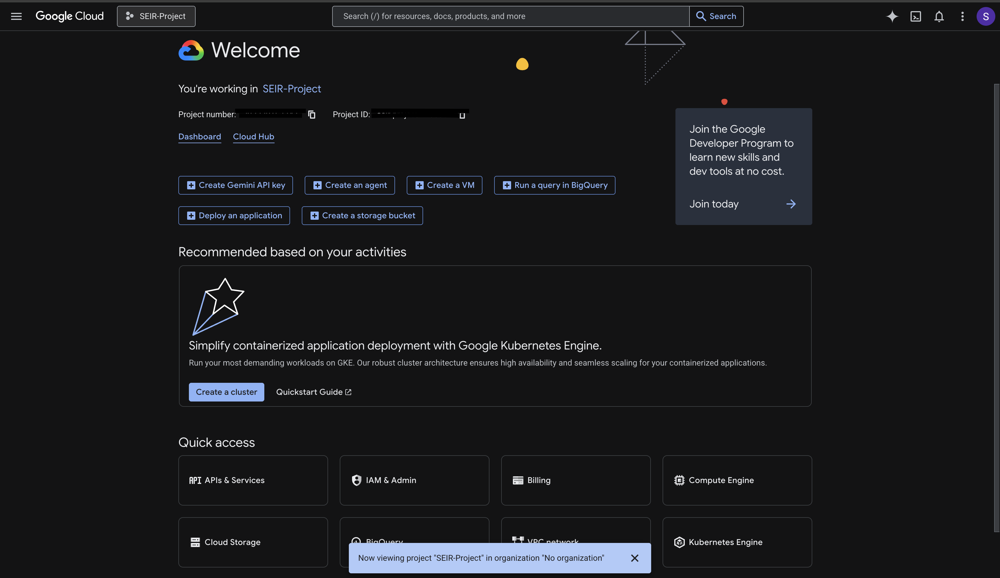
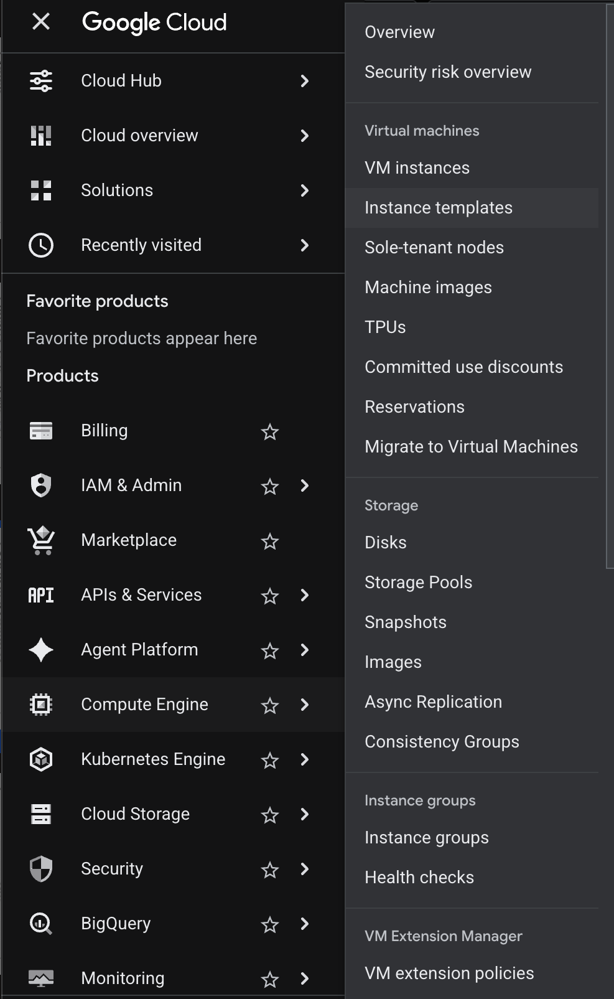
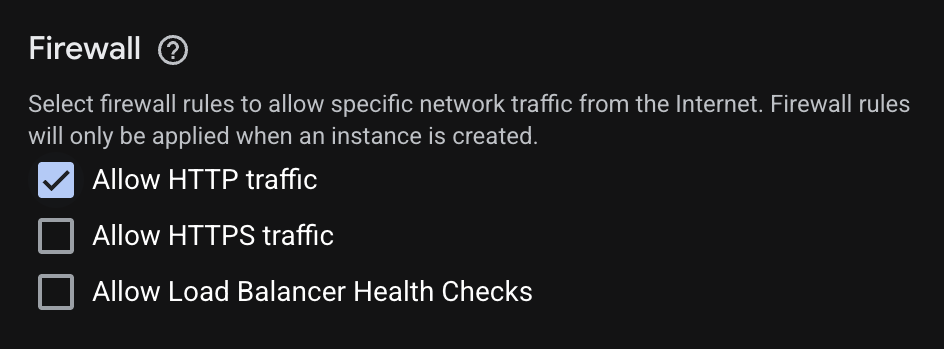
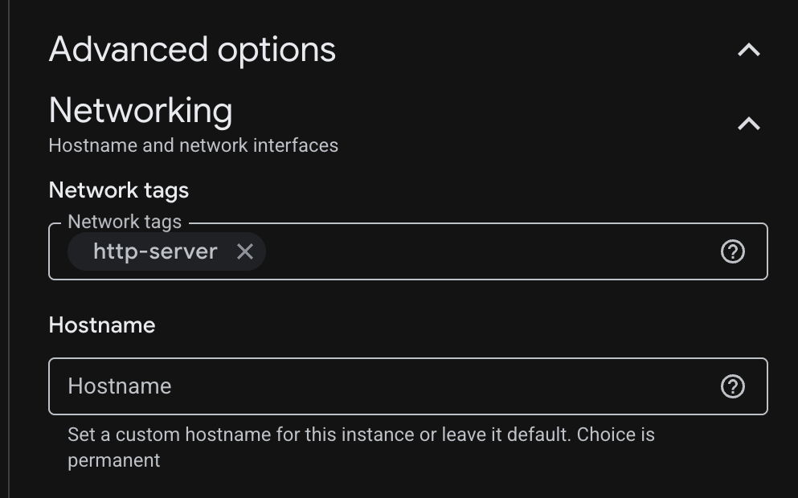
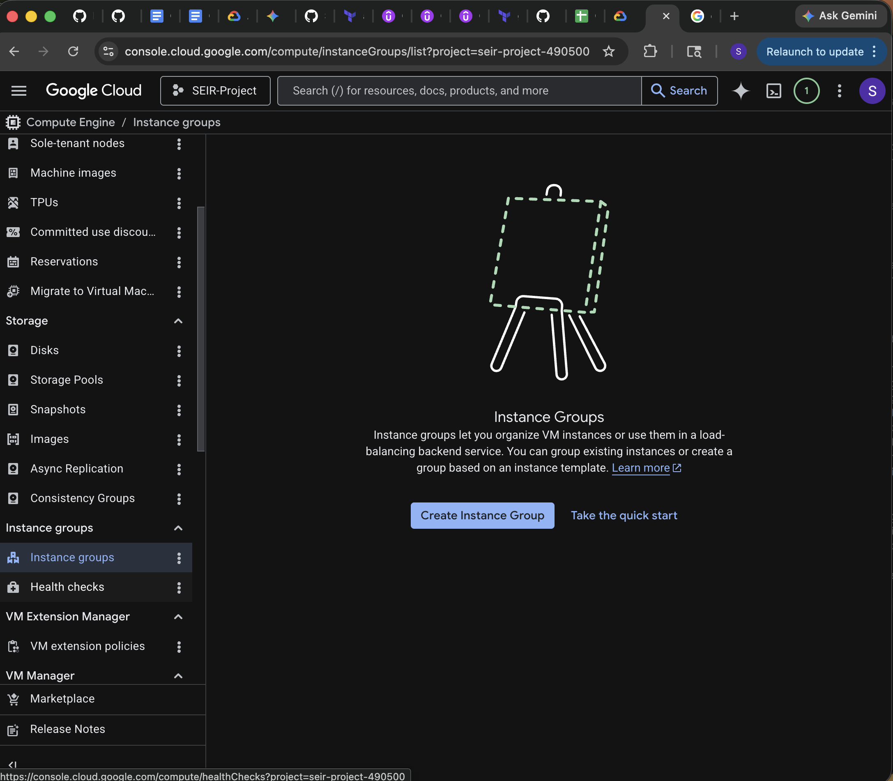
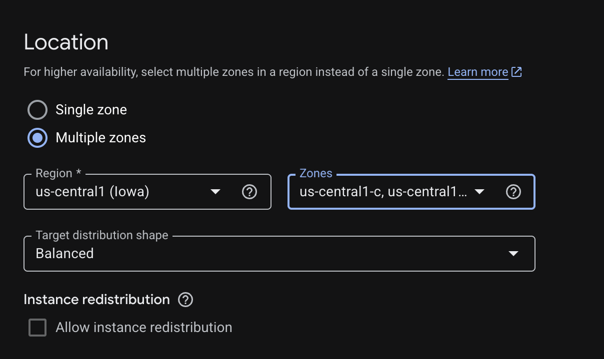
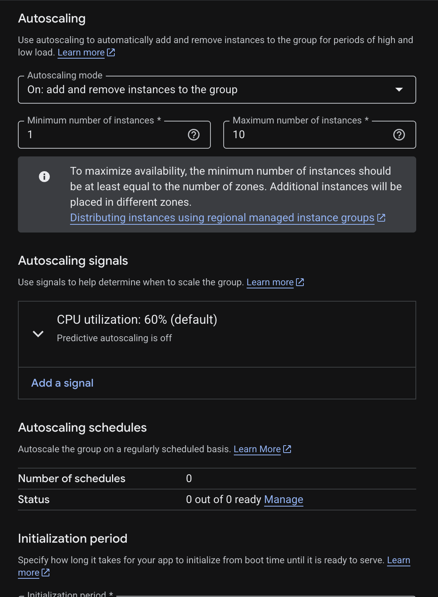
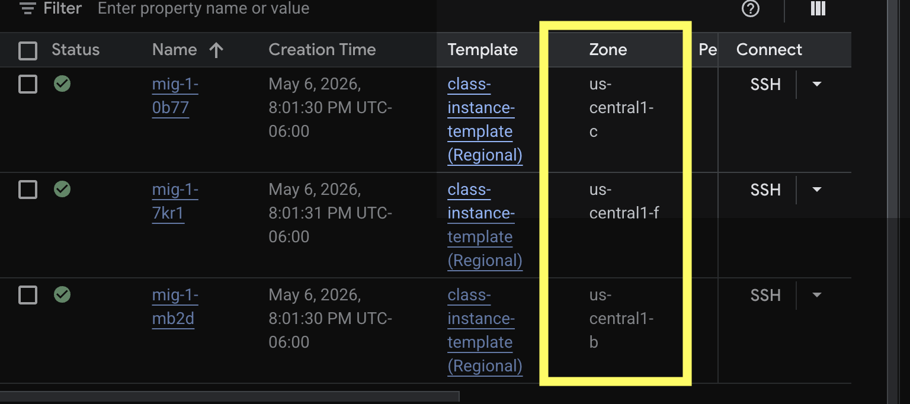

# Q&A

**1. What is the difference between high availability and fault tolerance? Which is best to strive for?** 
- A highly available system is a system that makes sure it is always accessible and operational even during failures and maintenance. It is meant to experience failures but they are minimal and shortly lived. Systems are highly available by having backups and failover mechanisms that are available to be switched over to when one part of the system goes down. Whereas a fault tolerant system is meant to be built to never fail. When the system experineces a failure, it is not noticable because the system is built in a way to experience that failure and swithc to a rendundant system that is already set up to continue the operations.
- Striving for fault tolerance or high availability depends upon the system and the needs that it has. A system that needs to always be running even while experiencing failures would be best to strive for fault tolerance. Meanwhile if the system is able to experience minimal downtimes with no issue than high availability should be tho goal. The key difference is the pricing. Fault tolerance may be seen as the better option due to the system never being down, it also costs a lot more than high availability. Using either comes with it's own trade-offs.
- https://www.ibm.com/docs/en/powerha-aix/7.2.x?topic=aix-high-availability-versus-fault-tolerance
- https://www.scalecomputing.com/resources/fault-tolerance-vs-high-availability  
**2. Explain the difference between autoscaling and elasticity. What is vertical and horizontal autoscaling? Is one better? Are they feasible on prem?**
- Elasticity refers to systems ability to expand or contract to fit the needs of the business while autoscaling is the actual process that allows a system to expand or contract based upon the business needs. 
- Vertical autoscaling is when you upgrade the ability of the server or virtual machine by increasing CPU or RAM.
- Horizontal autoscaling is when you add more servers to the infrastructure to handle the load.
- I personally would not say that one is better than the other because they each come with their own drawbacks. In the case of vertical scaling, you are limited in how much you can scale up due to the fact that it is constrained by hardware limitations. Whereas with horizontal scaling you can scale out to infinity but that adds complexity in managing multiple systems. Then you have to think with horizontal scaling, the more systems you add, the more you have to maintain. That is multiple systems you have to maintain, upgrade, check, and etc. So you add more work with horizontal scaling where with vertical scaling there is only one system to maintain.
- I would say that both are feasible but I would not think that they would be practical. Adding more systems constantly with horizontal scaling could be costly due to having to pay for the electricity costs of all the systems, needing the space, and having to maintain them. Your systems would be highly available but the costs would outweigh the benefits in the end. Vertical scaling would be cheaper to maintain initially but the costs of constantly upgrading could eventually get costly too. Vertical scaling also introduces a single point of failure which could prove problematic and lead to significant downtime issues when being upgraded.
- https://www.geeksforgeeks.org/system-design/system-design-horizontal-and-vertical-scaling/ 
**3. Explain what the difference between managed and unmanaged instance groups is.**
- A managed instance group is a grouping of **identical** virtual machine instances that can be managed together using an instance template. This comes with automated services that include autoscaling, autohealing, multi-zone deployments, and updating. 
- An unmanaged instane group is also a groiuping of virtual machine instances but they are not identical. They also are forced to be created in a single subnet so they are not able to deployed in multiple zones. They are mostly used for virtual machines that need their own settings and each need to be customized. GCP does not help manage the virtual machines so if one dies, it won't recreate it for you.
- https://docs.cloud.google.com/compute/docs/instance-groups
- https://docs.cloud.google.com/compute/docs/instance-groups/creating-groups-of-unmanaged-instances
**4. Explain the different use cases for health checks used by applications (in instance groups) and health checks used by load balancers. Can they be the same? Are they different API calls? Should they be the same?**
- Instance group health checks are used to make sure that the required number of instances that you set in the autohealing tab are constantly running. If not it will replace an instance with a new one to maintain that number
- Load Balancer health checks are used to check the health of instances too but only to make sure that they are ready to receive traffic. They will not recreate an instance if it is deemed unhealthy.
- They can be the same but it is not recommended because they are doing two different processes.
- They are the same call because they both use the same `compute.healthChecks` resource
- they should be the same because Google has a centralized health check system. It just depends on where those health checks are sent that determines their behavior.
**5. Explain in a few sentences what the 3 tier architecture is and how it relates to what you are learning**
- The 3 tier architecture is a model that is used a lot in modern Database Management Systems. This is a client server model which seperates tasks between servers and clients over a network. The three tiers are user interface, application processing, and data management. I can see that most of our learning is in the application processing layer which handles the business logic of the application. In class we are finding ways of taking user requests or inputs and communicating those with the data management layer to retrieve or store data. 
- https://www.geeksforgeeks.org/dbms/introduction-of-3-tier-architecture-in-dbms-set-2/

# Runbook

The purpose of this runbook is to give the reader a full walkthrough of how to fully create and configure a managed instance group in GCP via the console. At the end of this walkthrough you will have created a managed instance group, with autohealing and autoscaling features, and you will also be able to verify that the instance group will manage instances across multiple zones.

## Prerequisites

- a GCP account with access to the GCP console
- a project created within the the GCP environment.

### Process

**First we create the Instance Template**

1. You want to begin at the GCP Console in your selected project:

2. Navigate to Compute Engine, then Instance Templates:

3. Create instance template
4. Name your template, select your region, then scroll down to the firewall section
5. Under Firewall, you want to select **Allow HTTP traffic**

6. Go to Advanced Options and make sure that it shows `http-server` underneath the Network Tags

7. Scroll down to Automation and add your startup script
8. Scroll all the way to the bottom and click Create

**Now, we create the instance group**

1. Navigate down to Instance Groups:

2. Create Instance Group
3. Name your group, then select the instance template you created from before
4. Select the number of instances you wish to create
5. Scroll down to location and select the region and zones you wish for your group to reside in

6. Scroll down to autohealing and select Create Health Check
7. Change scope to regional and select your Region
8. Turn Logs to On
9. Save the health check
10. Scroll to the bottom and Create your instance group

### Notes

- **How did we enable autoscaling?**
Auto scaling is initially on when you create the instance group but you can configure settings in the Autoscaling tab

- **How did we enable autohealing?**
Autohealing was enabled when we created the health check. The health check will ensure that our instances are heatlhy and if not they will call for them to be deleted and recreated.
- **How do we verify that the instance group will manage instances across multiple zones?**
When you select your newly created managed instance group, if you look down at the bottom where it shows your created instances. You will see that you have instances created across the 3 different zones you selected in the configuration settings.


# Terraform

## Mandatory Arguments for a VM

1. `boot_disk` - specifies size and the VM image of the primary Persistent Disk that will be attached to the virtual machine.
- https://www.oreilly.com/library/view/google-cloud-platform/9781788837675/faefc240-9e60-409d-bf8c-a635b4974416.xhtml
2. `machine_type` - specifies the type (size) of the instance. This setting particularly chooses the processing power and memory of the virtual server
- https://dev.to/realnamehidden1_61/what-are-machine-types-in-google-compute-engine-5h28
3. `name` - the unique name for the resource. (This is the name you see in the list of resources)
- https://registry.terraform.io/providers/hashicorp/google/latest/docs/resources/compute_instance
4. `network_interface` - this is where you attach your VM to the network. Can either be attached to the default network or to a subnet of your choice as long as it is in the same region.
- https://registry.terraform.io/providers/hashicorp/google/latest/docs/resources/compute_instance#nested_network_interface 

## How to Output the internal and external IP addresses of your provisioned VM
- to output the internal and external IP addresses of your provisioned VM you first want to go to the terraform registry and see what attributes are exported
- go to https://registry.terraform.io/providers/hashicorp/google/latest/docs/resources/compute_instance and scroll down to see the **Attributes Reference** section
- from there you will see `network_interface.0.network_ip` is the internal ip address of the instance, and `network_interface.0.access_config.0.nat_ip` is the external or ephemeral IP address.
- you will use both in the value argument for your outputs as so:
```
output "internal_ip" {
  description = "displays the internal IP of the VM"
  value       = google_compute_instance.week8.network_interface.0.network_ip
}

output "external_ip" {
  description = "displays the external IP of the VM"
  value       = google_compute_instance.week8.network_interface.0.access_config.0.nat_ip
}
```
## 2 Non-required Arguments with explenations

1. `allow_stopping_for_update`- this can either be set to true or false. If true Terraform will stop the instance when you change settings or need to update its properties. Ultimately this allows updates to the VM that would require a reboot.
2. `shielded_instance_config` - this setting enables **Shielded VM** on the instance. Shielded VM's have firmware-level attack, bootloader modification, and kernel-level compromise protection.
- https://docs.cloud.google.com/compute/shielded-vm/docs/shielded-vm

## 3. How I found the formatting for centOS stream 10 image

If you use the command `gcloud compute images list` on the command line this will list out all of the available images, their status, their project, and their family.
I then went to page 7 of the Terraform Google Cloud Essentials book where they had this main.tf already formatted out, which showed how the image argument should look:
```
resource "google_compute_instance" "this" {
    name                = "cloudshell"
    machine_type        = "e2-small"
    zone                = "us-central1-a"
    boot_disk {
        initialize_params {
            image = "debian-cloud/debian-11"
        }
    }
    network_interface {
        network = "default"
    }
}
```
From this example you can see that the formatting is `project-name/family-name`

## 4. Name vs. compute id vs. self-link

- `name` is the human readable name of the resource that is shown at output and in the consoles
- `compute id` is how terraform references the resources that are being created
- `self-link` is unique to GCP; a full URL that contains the information GCP needs to keep track of the resource, such as project and zone.
